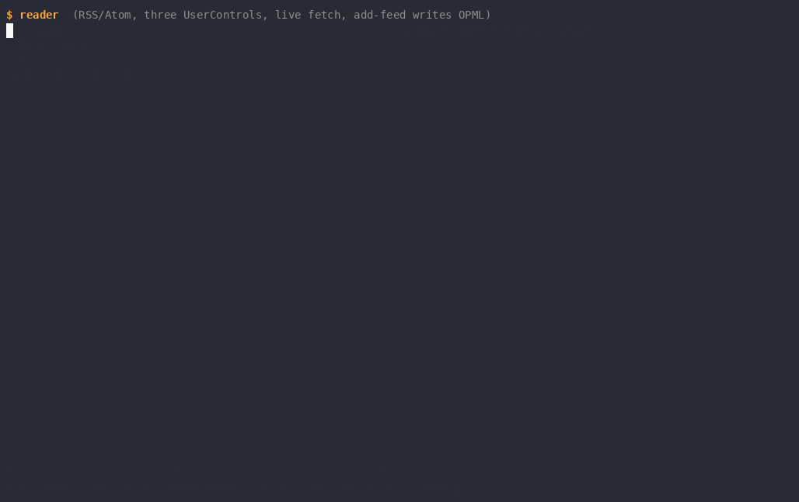
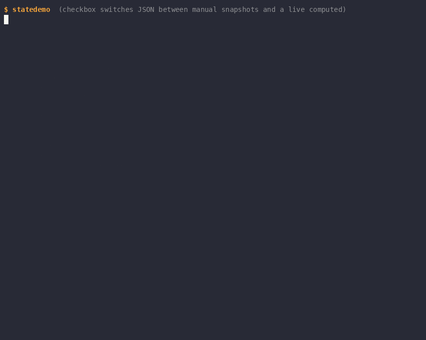
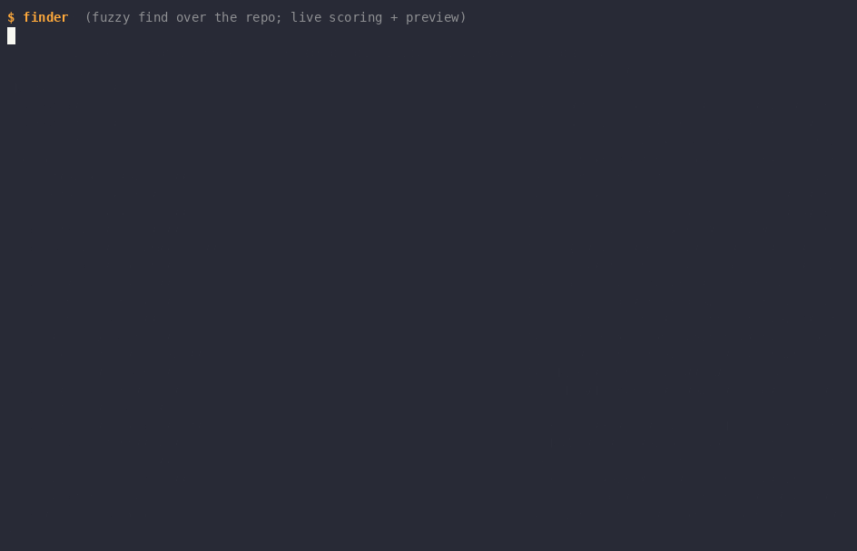

# gooey

A proof-of-concept XAML-like TUI framework for Go. Widgets live in a
retained visual tree with two-pass Measure/Arrange layout; every visual
property is a node in a lazy dependency-property graph, so a change
repaints exactly the widgets that read it. UIs are authored in XML
markup with Go-template-spelled bindings that resolve to property
handles at build time, hot-reload on save with state intact, and
compose into UserControls with isolated contexts. Input is routed:
commands, scoped KeyBindings, framework-owned focus with spatial arrow
navigation, and full mouse support via hit-testing. Rendering is
damage-tracked at the paint level, with pixel graphics (sixel, kitty,
iTerm2, halfblock fallback) riding a second plane over the cell buffer.

## Showcase



Three UserControl panes, one input system: focus-scoped keys, live
network fetches, and a feed added at runtime persisting to OPML.



Pure markup, no code-behind: buttons and a checkbox drive manual vs
reactive JSON serialization through the property graph.



An fzf-style fuzzy finder as a dependency graph: typing re-scores the
index live and damage tracking repaints only the affected panes.


Behavior declared in markup: one button is an HTTP GET, the other is a
Temporal activity run by a worker in another process — the terminal
names *what* runs, the app grants the capability, and the result lands
in a property.

## Quick start

```sh
go run ./cmd/statedemo
```

A UI is a `.gooey` file — elements map to widgets, attributes to
properties, `{{.Name}}` to bindings against your viewmodel:

```xml
<Gooey xmlns="wonderforge.io/gooey/2026">
  <Border Title="counter" Style="panel">
    <VStack Gap="1">
      <Text Style="accent">{{.Label}}</Text>
      <Button Content="+1" Click="{{.Increment}}"/>
      <KeyBinding Gesture="q" Command="{{.Quit}}"/>
    </VStack>
  </Border>
</Gooey>
```

Edit the file while the app runs and it reloads in place — state
survives, because it lives in the properties, not the widgets.
[docs/getting-started.md](docs/getting-started.md) builds this up in
five steps from a pure-Go tree to multi-control pages.

## Where it stands vs modern XAML

| Capability | Status | Notes |
|---|---|---|
| Retained tree + Measure/Arrange | done | Persistent widgets, measure/arrange sandwich via `MeasureChild`/`ArrangeChild`; Composer is fixed-size (no resize handling yet) |
| Dependency properties | done | Lazy dirty-tracking graph (Slint lineage), not eager WPF-style notification; UI-goroutine-confined |
| Bindings | done | `{{.Path}}` resolves once at build time to property handles (lvalue semantics); mixed text content; typed handles across element boundaries. No converters or two-way markup syntax — two-way is widget code |
| Markup + hot reload | done | XML over any `fs.FS`; `Watch`/`WatchAll` poll ModTimes and rebuild, viewmodel state survives |
| UserControls | done | Context isolation, data crosses only via attribute hand-off; property surface is implicit and unchecked (see x:Property) |
| Grid / star sizing | done | `Auto`/`Fixed`/`Star` tracks with spans, XAML `GridLength` semantics |
| Canvas / absolute layout | done | `Canvas.Left`/`Canvas.Top` attached properties; children may overlap, paint order is tree order |
| Timers | done | `<Timer Interval="600ms" Tick="{{.Fn}}"/>` — non-visual attachment; the goroutine posts through the Dispatcher and the Composer owns its lifetime, so a hot reload cannot leak one |
| Commands + KeyBindings | done | `Command` is `func()`; bindings are non-visual attachments scoped by where they are declared; dispatch bubbles, navigation runs in the unconsumed tail |
| Focus + mouse | done | Framework-owned focus (`FocusState`), spatial arrow navigation (XYFocus), hit-testing, hover, implicit capture, click synthesis, SGR and legacy X10 decoding; focus/hover damage is just property damage |
| Styles / templates | partial | `Style="name"` is a named lookup; `Style="{{.Handle}}"` binds a live `render.Style` property, so a computed style is reactive. No cascading, selectors, or overrides; DataTemplates do not exist (lists are hand-rendered widgets) |
| Color depth adaptation | done | Truecolor / 256 / 16 detected per session; the buffer stays 24-bit and downsampling happens at the wire. Widgets read `Frame.Caps` to adapt |
| x:Property (markup-declared properties) | designed | [Spec](docs/specs/2026-08-10-markup-declared-properties.md); not implemented |
| Handler namespaces (xmlns, Temporal) | done | `{{net:Get .Url \| into .Body}}` — events bound to framework handlers declared in markup; registration is the capability grant. One pipeline stage (`into`), one result, no retry surface yet ([spec](docs/specs/2026-08-10-remote-handlers-design.md)) |

## Demos

All are cataloged with walkthroughs in [docs/demos.md](docs/demos.md).

| Demo | GIF | Proves |
|---|---|---|
| `cmd/probe` + `cmd/demo` | [demo.gif](demo.gif) | Capability detection and the graphics pipeline (`--mode` forces a protocol) |
| `cmd/propdemo` | [propdemo.gif](propdemo.gif) | Lazy property graph: unwatched sources render zero frames |
| `cmd/logview` | [logview.gif](logview.gif) | Conditional dependency recording: pause drops the firehose out of the graph |
| `cmd/markuplog` | [markuplog.gif](markuplog.gif) | Markup hot reload: live edits rebuild the tree, buffer intact |
| `cmd/finder` | [finder.gif](finder.gif) | Input-to-derived-view pipeline with per-pane damage |
| `cmd/reader` | [reader.gif](reader.gif) | Multi-UserControl composition, scoped input, live fetches |
| `cmd/statedemo` | [statedemo.gif](statedemo.gif) | No-code-behind markup and reactive serialization |
| `handlers/temporal/cmd/temporaldemo` | [temporaldemo.gif](temporaldemo.gif) | Handler namespaces: a button whose behavior is a remote Temporal activity |
| `cmd/colordemo` | [colordemo.gif](colordemo.gif) | Canvas absolute layout, per-terminal color tiers, and a page styled live by the color being picked |
| `cmd/sysmon` | — | Not yet cataloged |

## Documentation

- [docs/getting-started.md](docs/getting-started.md) — hands-on tutorial, five steps to a componentized app
- [docs/architecture.md](docs/architecture.md) — the deep guide: rendering planes, property graph, Composer, input, markup
- [docs/markup-reference.md](docs/markup-reference.md) — every element, attribute, gesture, and binding rule
- [docs/demos.md](docs/demos.md) — what each demo exercises, with walkthroughs
- [docs/specs/](docs/specs/) — decision records: [markup-declared properties](docs/specs/2026-08-10-markup-declared-properties.md), [reader design](docs/specs/2026-08-10-reader-design.md), [remote handlers](docs/specs/2026-08-10-remote-handlers-design.md), [container backgrounds](docs/specs/2026-08-10-container-backgrounds.md)

## POC limits, honestly

Damage tracking stops at the paint level: the flush still writes the
whole buffer every frame (damage-rect diffing is a drop-in replacement
at `Flush`). The Composer is static-tree — structural change means
rebuilding it, which is exactly what hot reload does — and fixed-size,
with no resize handling. There is no styling system (named style
lookup only) and no templates (every list is a hand-rendered custom
widget). The file watcher is 300 ms ModTime polling. Properties are
confined to the UI goroutine; background work crosses in over a
channel.

## Architecture decisions, one line each

- **Not N renderers — one cell renderer plus N graphics protocols**, on separate planes the terminal composites; halfblock is the universal cell-plane fallback: [the two rendering planes](docs/architecture.md#the-two-rendering-planes)
- **Capability detection is a handshake, not config** — Kitty query + XTWINOPS + DA1, preference kitty > sixel > iterm2 > halfblock: [detection](docs/architecture.md#capability-detection-is-a-handshake-not-config)
- **Properties are lazy, not eager** — a set marks dirty and computes nothing; evaluation records its own dependencies, so conditional reads watch only the taken branch: [the property system](docs/architecture.md#the-property-system)
- **"AffectsRender" is discovered, not declared** — each widget's paint is a computed node, so whatever it reads is its damage set: [the Composer](docs/architecture.md#the-composer)
- **Layout runs outside the evaluation context** — reads during Measure subscribe to nothing, keeping layout out of the graph by construction: [layout vs the graph](docs/architecture.md#layout-runs-outside-the-evaluation-context)
- **Framework state in source properties makes focus and hover damage free** — moving focus repaints exactly two widgets: [the input system](docs/architecture.md#the-input-system)
- **KeyBindings scope by attachment position, and navigation runs in the unconsumed tail** — a binding fires only while its subtree has focus; arrows are spatial (XYFocus) with a tree-order fallback: [routed dispatch](docs/architecture.md#routed-dispatch)
- **Both mouse encodings are decoded** — an undecoded legacy X10 report would inject phantom keystrokes, not just drop the event: [one ordered stream](docs/architecture.md#one-ordered-stream)
- **Bindings are handles, not values** — resolved once at build time, zero lookups at render: [markup](docs/architecture.md#markup)
- **Registering a handler namespace IS the capability grant** — markup reaches only the URIs its host registered, so an untrusted document is sandboxed by construction, and async results marshal back through a Dispatcher: [markup reference](docs/markup-reference.md#handler-namespaces)
- **The `fs.FS` seam is the deployment story** — `os.DirFS` in dev hot-reloads, `embed.FS` in release is a natural no-op, same code: [loading tiers](docs/architecture.md#three-loading-tiers-one-seam)
