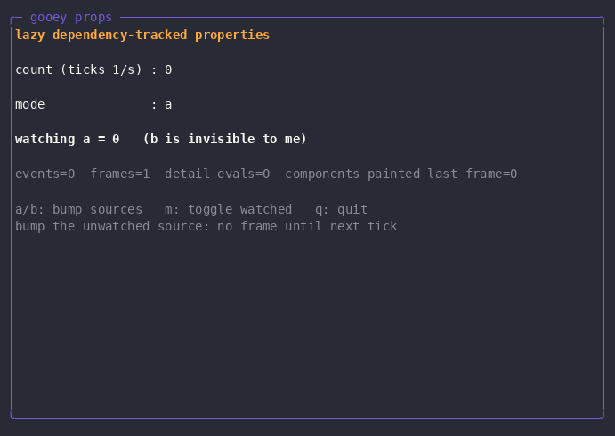
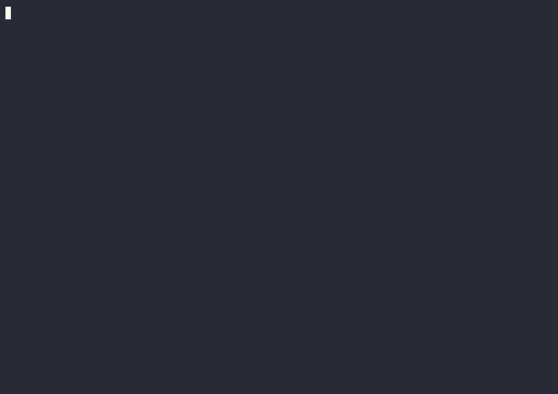
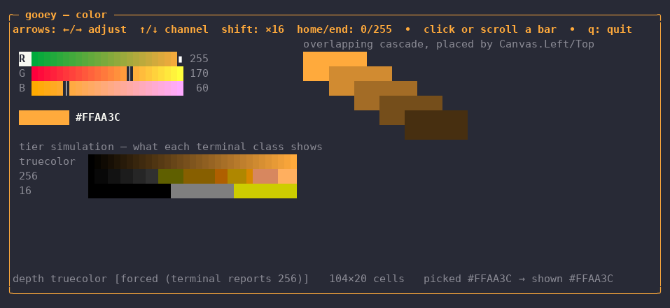
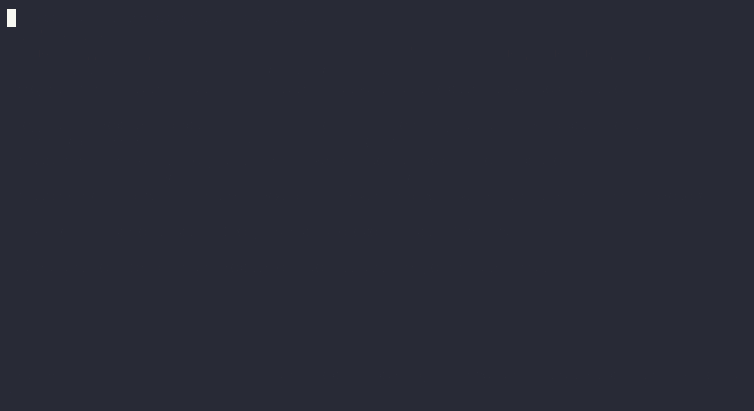

# Demo Catalog

Each demo under `cmd/` exercises one slice of the framework; most are recorded as a GIF at the repo root. Note: there is no `cmd/markupdemo` — the markup demo is `cmd/markuplog`.

`cmd/browser` launches any of them, and also lists the smaller finished examples from the tutorials under `docs/learn/examples/` as a second group. Which tutorial teaches the ideas behind each demo is tabulated in [learn/index.md](learn/index.md#demo-catalog).

```sh
go run ./cmd/browser
```

## probe / demo


Retained visual tree + graphics protocol detection (sixel/kitty/iterm2/halfblock).

`probe` reports the terminal's capabilities — size, cell pixel dimensions, and which graphics protocols it supports. `demo` then renders a retained component tree containing an image through the best available protocol, falling back to halfblock rendering.

- Run: `go run ./cmd/probe && go run ./cmd/demo`
- Keys: any key exits; `--mode` forces a protocol; `--dump` prints one frame

Exercises the terminal capability-detection layer (`term`) and the retained-tree renderer's graphics pipeline, which draws an image through the best or forced protocol.

## propdemo



Dependency-tracked properties only repaint what actually changed: hammering an unwatched source produces zero frames, watched bumps render instantly, and each frame repaints only 2 of 8 components.

The walkthrough: for the first ~3 seconds only the 1 Hz tick renders (frames 1-4, events=0). Then 'b' is pressed five times while the detail computed watches source a — no new frames appear until the next tick, when the events counter jumps from 0 to 5 in one hop (frames=5, "watching a = 0 (b is invisible to me)"). Pressing 'a' bumps the watched source and a frame renders instantly. 'm' toggles the watched source to b ("watching b", "a is invisible to me"), after which two 'b' presses render instantly — detail evals climb to 5 and only 2 of 8 components repaint per frame. 'q' quits.

- Run: `go run ./cmd/propdemo`
- Keys: `a`/`b` bump sources, `m` toggle watched, `q` quit

Exercises the dependency-property graph (`prop`) driving the retained tree: the whole scene is one computed property, so frames render only when something the UI actually read has changed.

## logview


Pausing flips the live buffer out of the dependency graph: 69 lines arrived during the pause while the ten frames that rendered were every one of them caused by a keystroke, not by the firehose — and the scroll and filter UI stayed fully interactive against the frozen snapshot.

The walkthrough: ~3 seconds of FOLLOW mode with the log firehose streaming and rendering live — the stats line tracks lines arrived, frames rendered, view evals, and components painted last frame. Space flips the header to PAUSED with `showing 24 lines`, and that count never moves again until the resume: the view is frozen on a snapshot while the stats line shows lines still arriving (24 to 93) and frames rendered creeping only from 26 to 36, one per key pressed. Six presses of 'k' scroll back through the frozen snapshot and End returns to its tail — the pane is a focus stop that owns its own scroll keys, so this works while paused. Pressing 'f' sets `filter: ERROR` and the UI re-renders from the snapshot showing only the 5 ERROR lines; 'f' again cycles to WARN (5 lines), then back to all. Space resumes and a single frame takes the view from 24 lines to 103, the whole backlog at once. 'q' quits.

Note when spot-checking the GIF: a paused UI emits almost no frames, so the PAUSED beat is only 6 of the 53 frames — but 10.2 of the 19.9 seconds. Sampling by frame index will walk straight past it; sample by cumulative delay instead.

- Run: `go run ./cmd/logview`
- Keys: `space` pause/follow, `f` cycle filter (all/ERROR/WARN), `j`/`k` and the arrows scroll (`pageup`/`pagedown` by a screen, `end` re-tails), `q` quit

Exercises conditional dependency recording: pausing flips a branch so the live buffer silently drops out of the graph — the firehose keeps appending with zero renders — and resuming re-records the dependency so the view catches up in one frame.

## markuplog


The markuplog UI is defined in a `.gooey` XML file that hot-reloads on edit: two live sed edits (a title change, then a new Grid row) rebuild the component tree in place while the log buffer, frame counter, and stream all survive untouched.

The walkthrough: the log viewer loads its Grid UI from `live.gooey` and streams colored log lines (title: logview, hot reloads=0). About 4 seconds in, an off-screen editor seds the file so the Border title becomes "logview ✦ LIVE EDITED" — the status line ticks to hot reloads=1 while lines arrived keeps climbing (52 and counting). ~3.5 seconds later a second sed extends the Grid Rows spec and inserts a new accent Text row ("★ this line was just added in the editor — no restart, buffer intact") above the LogPane — hot reloads=2, lines arrived=84, never reset. 'q' quits cleanly.

- Run: `go run ./cmd/markuplog [path/to/logview.gooey]`
- Keys: `space` pause/follow, `f` cycle filter (ERROR/WARN/all), `q` quit

Exercises the markup loader (`markup`) with hot reload: bindings resolve against the same property-graph viewmodel as logview, and the tree is disposable while the viewmodel properties are the durable thing — so state survives every rebuild.

## finder


A four-property, three-computed dependency graph drives an fzf-style fuzzy finder: typing re-scores the file index live (microsecond match times in the status bar), arrows move a selection property, and the preview pane derives from it — damage tracking repaints only the affected panes.

The walkthrough: finder opens on the repo index (133 files) with a query input, results pane, and preview pane. "compos" is typed character by character and the results narrow live to `composer.go`/`composer_test.go` with orange match highlighting and "2 matched in 54µs" in the status bar. Down-arrow moves the selection and the preview pane follows, switching from `composer.go` to `composer_test.go`. Six backspaces clear the query and all 133 files return. "gooey" is typed — 21 matches ranked by fuzzy score with subsequence highlighting, `cmd/finder/finder.gooey` on top with its own markup in the preview. A down-arrow selects `cmd/reader/reader.gooey`, and enter exits, printing `cmd/reader/reader.gooey` to the shell.

- Run: `go run ./cmd/finder`
- Keys: type to filter, `up`/`down` (or `ctrl-p`/`ctrl-n`) select, click a result row to select it (wheel scrolls the selection), `enter` print selection and exit, `esc`/`ctrl-c` quit

Exercises the full input-to-derived-view pipeline through the dependency graph — query, index, and selection properties feeding scoring and preview computeds — plus damage tracking that repaints only the results and preview panes, all inside a hot-reloading markup shell (`finder.gooey`).

## reader


Three UserControl panes share one input system — tab cycles focus, live network fetches fill each pane, and adding a feed at runtime updates the list and persists to `feeds.opml`.

The walkthrough: reader launches and four default feeds fetch live over the network, filling in with story counts (Lobsters (25), The Go Blog (10), Cloudflare Blog (20)). 'j' selects Lobsters in the feeds pane (initial focus), tab moves focus to the stories pane — the filled-dot focus indicator appears in its title. 'jj' plus enter opens a story and the reader pane fills with title, date, link, and body. Tab back to feeds, 'a' opens the add-feed input, and `https://xkcd.com/atom.xml` is typed character by character. Enter fetches the new feed: xkcd.com (4) appears in the feed list and `feeds.opml` is written. 'q' quits; the shell echoes `feeds.opml` showing all 5 outline entries including xkcd.com.

- Run: `go run ./cmd/reader`
- Keys: `tab` cycle pane, `j`/`k` move, `enter` open story, `a` add feed, `q` quit

Exercises multi-UserControl composition: three `.gooey` controls with their own contexts, data crossing boundaries only through attribute bindings, and the framework's input system — focus stops, per-pane key handling, and `<KeyBinding>`s declared in markup bound to viewmodel commands.

## statedemo


Buttons + checkbox: manual JSON snapshots vs reactive serialization through the property graph.

The walkthrough: a manual serialize goes stale as clicks mutate state; checking auto-serialize swaps the text box to a live computed; from then on every click re-serializes reactively.

- Run: `go run ./cmd/statedemo`
- Keys: click or `tab`+`enter`/`space`, `s` serialize, `q` quit

Exercises the "no code-behind" contract — pure markup with built-in components and all delegates in the viewmodel — and viewmodel-side state serialization, where typed property handles are snapshotted into a plain struct for `encoding/json`.

## temporaldemo



Two buttons with no delegates: one is an HTTP GET, the other is a Temporal activity executed by a worker on a task queue — in-process by default, on another machine if you start one there.

The walkthrough: pressing `[ net:Get ]` fills the first box from the demo's own loopback server; pressing `[ temporal:Activity Slugify ]` sends `.Input` to a worker on the `gooey-demo` task queue and the returned JSON — including the worker's hostname and pid — lands in the second box; cycling the input and pressing again slugifies the new phrase, because the argument is a handle read at invoke time rather than a value captured at load.

- Run: needs a Temporal dev server; the demo brings its own worker, both from `handlers/temporal/`:

  ```sh
  temporal server start-dev --headless          # shell 1
  go run ./cmd/temporaldemo                     # shell 2
  ```

  The worker runs in-process as a gooey companion, started before the first frame and stopped with the app. To run it out of process instead — the deployment this models — start it yourself and tell the demo not to:

  ```sh
  go run ./workers/temporalworker                # shell 2 (or another machine)
  go run ./cmd/temporaldemo --with-worker=false  # shell 3
  ```

  `TEMPORAL_ADDRESS` and `GOOEY_TASK_QUEUE` override the defaults for both binaries.
- Keys: `tab` move, `enter`/`space` press, `n` net, `t` temporal, `c` cycle input, `q` quit

Exercises handler namespaces end to end: xmlns prefix capture, the `{{ns:Func … | into .Target}}` grammar, registration-as-capability-grant, and the Dispatcher marshaling async completions back onto the UI goroutine. The demo and its worker live in the `handlers/temporal` module rather than `cmd/`, because that is where the Temporal SDK dependency is quarantined — core gooey builds without it.

## temporalops


The Temporal ops dashboard: live visibility data in a TUI, with every Temporal call declared in markup. A query bar speaks Temporal's visibility query language, the execution list is an `ItemsView` over real `temporal.api.*` responses, the status bar counts every match, and the describe pane follows the selection:

```xml
Click="{{temporal:Activity `visibility.Query` .Query .PageSize .PageToken | into .RowsJSON}}"
SelectionChanged="{{temporal:Activity `visibility.Describe` .SelectedWorkflowID .SelectedRunID | into .DescribeJSON}}"
```

The activities are the `packs/temporal-visibility` pack's *convenience layer* — scalar arguments in, protojson text out — because that is exactly what can cross the markup boundary: each argument is a string read from a property at invoke time, and the result is delivered into a string property. The viewmodel (`handlers/temporal/internal/ops`) never talks to Temporal; it parses what the activities deliver (rows projected via `ItemsOf`, the selected row's IDs, the count) and keeps the page-token history that `next`/`prev` replay — the token itself round-trips verbatim as the base64 text protojson made of it.

The walkthrough: the opening fetch fills page one (25 of 30 running executions) and the count; moving the selection describes each execution into the lower pane — `executionConfig`, pending activities, the canonical protojson every other Temporal tool shows; `ctrl+n` follows the response's `nextPageToken` to the 5-row page two; `ctrl+p` replays the remembered token back to page one.

- Run: needs a Temporal dev server; the demo brings its own worker (the visibility pack served as a gooey companion), both from `handlers/temporal/`:

  ```sh
  temporal server start-dev --headless          # shell 1
  go run ./cmd/temporalops                      # shell 2
  ```

  or truly one shell — the dev server as a `CompanionCmd` child process:

  ```sh
  go run ./cmd/temporalops --with-dev-server
  ```

  or workers where the compute is:

  ```sh
  go run ./workers/visibilityworker              # shell 2 (or another machine)
  go run ./cmd/temporalops --with-worker=false   # shell 3
  ```

  `TEMPORAL_ADDRESS`, `TEMPORAL_NAMESPACE` and `GOOEY_TASK_QUEUE` override the defaults for both binaries. Something must be *running* for the list to show — `temporal workflow start --type Anything --task-queue seed-q --workflow-id demo-1` a few times seeds it.
- Keys: type in the query bar, `enter` run, `tab` move focus, `↑`/`↓` select (describes the selection), `enter` on the list re-describe, `ctrl+n`/`ctrl+p` page, `ctrl+r` refresh, `ctrl+c` quit

Exercises the whole phase-2 stack: the visibility pack's scalar convenience activities (the only shapes that survive both markup boundaries — string args in, string result out of the provider's `any`-typed decode), `ItemsView` + `ItemsOf` over protojson rows with the selection-move damage pinned at three paint nodes, markup-built commands invoked from viewmodel intents through their `Name` (run/next/prev are bookkeeping around the same command the button carries), and the visibility worker as a companion.

## colordemo



Absolute layout, capability-adaptive color, and a component whose experience changes with the terminal.

The walkthrough: the `ColorPicker` edits one `Accent` property; the border, title, and swatch cascade are all styled by a computed `render.Style` over it, so moving a channel restyles the page through the property graph. The page is a filled surface — `Background="#12121e"` on the Border, painted by the framework, with every leaf pre-clearing against it. Everything inside the frame is placed by a `Canvas` — the picker, the tier strip, and a cascade of swatches at absolute coordinates that deliberately overlap, later siblings painting over earlier ones (safe under damage tracking: the Composer's z-ordered repaint restores the stack when an occluded swatch repaints alone). The tier strip draws one gradient three times, pre-approximated to each color depth with the same function the flush uses, so a single terminal shows what all three classes of terminal would do.

The GIF runs the demo twice, `--depth=truecolor` and then `--depth=256`, driven by identical keystrokes so the two tiers can be compared at the same color: the truecolor pass shows smooth bars, a wide swatch, and a bare `#FFAA3C`; the 256 pass shows banded bars, a narrow swatch, and `#FFAA3C → xterm 215`. On a 16-color terminal the bars stop pretending to be gradients at all and become a fill meter with `≈ yellow`.

- Run: `go run ./cmd/colordemo`, or `--depth=truecolor|256|16` to force a tier
- Keys: `↑`/`↓` channel, `←`/`→` adjust (shift = ×16), `home`/`end` saturate, click or scroll a bar, `q` quit

Exercises the `Canvas` panel and its `Canvas.Left`/`Canvas.Top` attached properties, depth-aware SGR emission (`38;2` / `38;5` / `30-37`) with the buffer staying 24-bit throughout, capabilities reaching components through `Frame.Caps`, and bound `Style` attributes as the closest thing gooey has to theming.

## toolkitdemo



The toolkit on one page, spelled entirely in markup: the six wave-1 components plus wave 2's overlays — a `MenuBar` over the content, a `ToastHost` popping notifications — and the adornment plane: tooltips on the buttons, shown through an `AdornmentLayer`.

The walkthrough: the job opens in its fetch stage, which has no measurable progress — so the `ProgressBar` marches a band instead of claiming a number, and the `Spinner` turns beside it. The pointer rests on `[ start ]` and, after the 600ms delay, its tooltip appears below the button; sliding to `[ toast ]` swaps it for that button's tip — never two at once — complete with the dim `ctrl+t` gesture hint (the child-form `<Tooltip>` with `Gesture=`; the others are `Tooltip="…"` shorthands). Moving away restores the covered cells exactly. Then `shift+tab` reaches the `MenuBar` and `enter` drops the Job menu **over** the content rows, gesture hints right-aligned per item; `↓` walks the items (the separator is skipped), `→` slides the dropdown to the Notify menu — the cells the first dropdown vacated repaint from what was beneath — and `enter` on "Toast the status" closes the menu and pops a toast in the top-right corner, which takes itself down 2.5s later and leaves no scar. Meanwhile the build finishes on its own. The `StatusBar` along the bottom is bound the whole time: status on the left, a clock in the middle, key hints on the right, each its own paint node.

- Run: `go run ./cmd/toolkitdemo`, or `--mode=kitty|sixel|iterm2|cells` to force the pixel button's chrome, `--hold=15s` to exit unattended
- Keys: `tab` move focus, `enter`/`↓` open the focused menu, `esc` close it, `←`/`→` traverse bars and menus, `space` toggle, `ctrl+t` toast, `q` quit; hovering any ButtonBar member shows its tooltip (any key or press dismisses it)

Exercises the toolkit end to end: the Startable animation discipline shared by `ProgressBar`, `Spinner`, the toast auto-dismiss timers, and the tooltip delay (post, never touch the graph from the goroutine; stop closes and joins), rocker arrow semantics that consume a key only when it moves something, `ButtonBar` uniform sizing and its `gooey.FocusHost` focus scope, pixel button chrome placed per paint node — and the overlay story: document order is z-order, so the `MenuBar`, `ToastHost` and `AdornmentLayer` are declared as the Grid's *last* children while `Grid.Row` keeps the bar on the top row, the open menu holds the pointer capture so a click elsewhere dismisses without activating what is underneath, and dismissing any overlay — menu, toast, or tooltip — repaints exactly the components it was covering (the Composer's restore pass).

The GIF's mouse beats are real SGR motion reports injected through the recording pty — hover works under `script`/asciinema even though the pty renders no cursor.

The GIF is recorded under a pty, which reports no graphics protocol, so the pixel button is showing its universal tier: the same three-row pill drawn in box-drawing runes. That is the honest result of recording, not a fallback the component reaches for by accident — the pixel tiers are verified separately, by driving the demo with `--mode` and checking the protocol bytes in the captured log.

## browser

The front door: a launcher that lists every demo under `cmd/` and every
tutorial example under `docs/learn/examples/` as two labeled groups, shows a
preview of the selected entry, and hands the terminal to whichever one you
run — taking it back when the program exits.

The preview pane is itself a small showcase: if the selected entry's
directory has a `README.md` it renders **as markdown** (styled headings,
bold, inline code, fenced blocks, bullets, underlined links — see
`cmd/reader/README.md`); otherwise the entry's `main.go` doc comment is
shown. If a recording exists (`recordings/<name>.gif` or a checked-in
GIF under `docs/media/demos/`),
`p` plays it in the pane — decoded with `image/gif`, frames coalesced, and
animated as halfblock cells at the GIF's own frame delays; the animation
stops on selection change and before every hand-off. The whole listing is
live: the browser watches `cmd/`, the example directories, and
`recordings/`, so a new demo, an edited README, or a recording created
while it runs appears without a restart (recordings are marked ● gif / ○
cast and feed the info pane; ▶ marks an entry playable from a GIF outside
`recordings/`, which is where most of the checked-in ones live).

`r` records the selected entry: the run is wrapped in `asciinema rec`
(the demo drives the recorded terminal) and converted to a GIF with `agg`
when available — artifacts land in `recordings/` and immediately show up
in the listing.

The tree being browsed doesn't have to be the tree the browser was
launched from. `b` opens a **source picker**: every worktree of the
repository (name, tip subject, `*` when it has tracked modifications) and
every local branch that has no worktree. Picking a worktree switches to
it; picking a bare branch materializes a throwaway **detached** worktree
under the system temp dir and browses that — so you can flip between a
demo on `main` and the same demo on a feature branch without touching
either checkout. The demo list, README/GIF previews, the watcher, `enter`
and `r` all resolve against the selected source (nested-module demos keep
working — `go run` happens in the source's own root, so its `go.mod`
graph applies); demos that don't exist on an older branch simply don't
appear. Two things deliberately stay anchored to the launch tree: the
browser's own UI, and `recordings/` — a recording is an artifact you
keep, and the ephemeral worktree it was made from is deleted on
switch-away and on exit (`git worktree remove` + `prune`; ctrl+c included,
since cleanup runs before the exit signal is re-raised). Real worktrees
are only ever read — never checked out, never written.

- Run: `go run ./cmd/browser` (from anywhere in the repo)
- Keys: `j`/`k` or arrows select (click/wheel too), `enter` run, `r`
  record, `p` play/stop a recording, `b` sources (then `j`/`k` select,
  `enter` switch, `esc` close), `q`/`esc` quit

Exercises the `fs.FS` seam as a live data source, `gooey.App.Suspend` for
the terminal hand-off (the tty read-lifecycle invariant is what makes the
child's stdin safe), the Startable/dispatcher lifecycle for the GIF
animation (the preview component owns a ticker that posts frames through the
dispatcher and is joined on stop — the same discipline as `<Timer>`, not
the element itself),
the damage system — an animation tick repaints exactly one component, and
the picker's damage is pinned too (open paints the overlay, navigation
repaints the popup alone, dismissal restores exactly what was covered) —
and the MenuBar overlay recipe reused in an app: last-in-document-order
z-order, modal focus with key swallowing, pointer capture while open,
focus restored on dismiss. All git work (enumeration, `worktree add`
/ `remove`) runs on one worker goroutine and marshals back through the
dispatcher, per the UI-confinement rule.

## sysmon

A live system monitor over real `/proc` data — per-core CPU gauges, a
memory gauge, a total-CPU sparkline, and a process table sortable by CPU
or memory.

It is the demo where the extracted visual components earn their keep:
the gauges and the sparkline are the framework's own `components.Gauge` and
`components.Sparkline` (they were written here first, then promoted), with
threshold coloring driven by the sampled values. Every displayed number
flows through a dependency property, and the sampler only `Set`s values
that actually changed — so on an idle system a 700ms tick repaints
almost nothing, and the damage counter proves it. The process table
stays demo-local deliberately: generalized lists are the DataTemplates
epic, and this table is one of its target consumers.

- Run: `go run ./cmd/sysmon`
- Keys: `c`/`m` sort the process table by CPU / memory, `q` quit

Exercises viewmodel-side dedup against the property graph (Set only on
change), the promoted Gauge/Sparkline components, threshold styling,
and a screen-wide composition sampled from a real, noisy data source.
