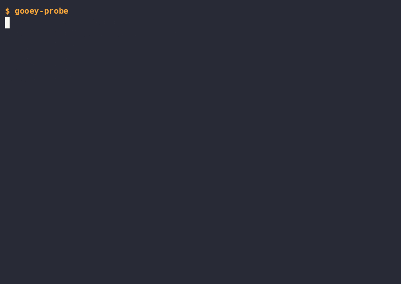
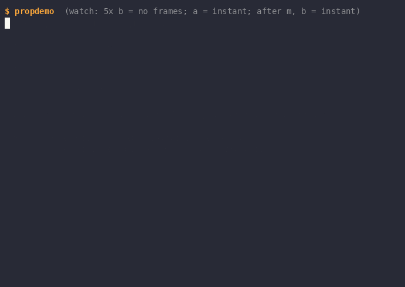
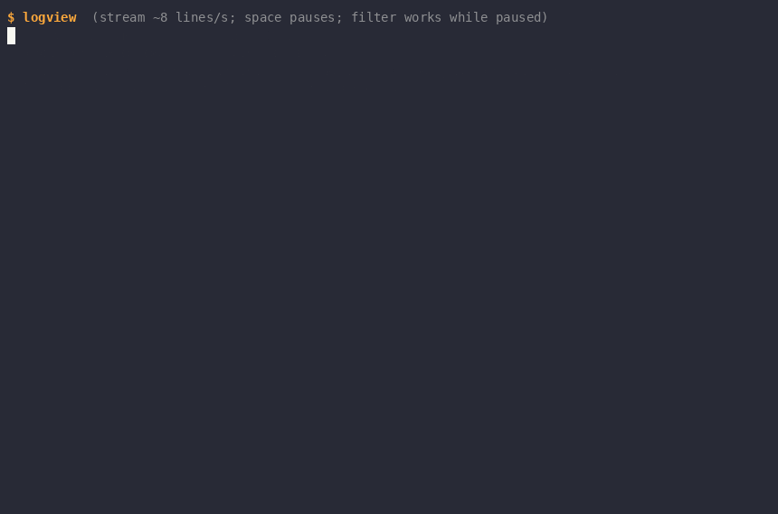
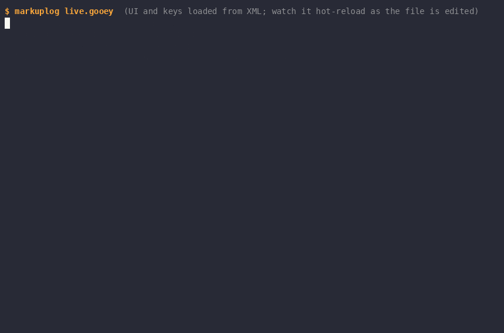

# Demo Catalog

Each demo under `cmd/` exercises one slice of the framework; most are recorded as a GIF at the repo root. Note: there is no `cmd/markupdemo` — the markup demo is `cmd/markuplog`.

## probe / demo

Retained visual tree + graphics protocol detection (sixel/kitty/iterm2/halfblock).

`probe` reports the terminal's capabilities — size, cell pixel dimensions, and which graphics protocols it supports. `demo` then renders a retained widget tree containing an image through the best available protocol, falling back to halfblock rendering.

- Run: `go run ./cmd/probe && go run ./cmd/demo`
- Keys: any key exits; `--mode` forces a protocol; `--dump` prints one frame

Exercises the terminal capability-detection layer (`term`) and the retained-tree renderer's graphics pipeline, which draws an image through the best or forced protocol.

## propdemo

Dependency-tracked properties only repaint what actually changed: hammering an unwatched source produces zero frames, watched bumps render instantly, and each frame repaints only 2 of 8 widgets.

The walkthrough: for the first ~2 seconds only the 1 Hz tick renders (frames 1-3, events=0). Then 'b' is pressed five times while the detail computed watches source a — no new frames appear until the next tick, when the events counter jumps from 0 to 5 in one hop (frames=4, "watching a = 0 (b is invisible to me)"). Pressing 'a' bumps the watched source and a frame renders instantly. 'm' toggles the watched source to b ("watching b", "a is invisible to me"), after which two 'b' presses render instantly — detail evals climb to 5 and only 2 of 8 widgets repaint per frame. 'q' quits.

- Run: `go run ./cmd/propdemo`
- Keys: `a`/`b` bump sources, `m` toggle watched, `q` quit

Exercises the dependency-property graph (`prop`) driving the retained tree: the whole scene is one computed property, so frames render only when something the UI actually read has changed.

## logview

Pausing flips the live buffer out of the dependency graph: 62 lines arrived during the pause while only ~4 frames rendered, yet the filter UI stayed fully interactive against the frozen snapshot.

The walkthrough: ~3 seconds of FOLLOW mode with the log firehose streaming and rendering live — the stats line tracks lines arrived, frames rendered, view evals, and widgets painted last frame. Space flips the header to PAUSED: the view freezes on a snapshot while the stats line shows lines still arriving (24 to 86) with frames barely moving (26 to 30). Pressing 'f' while paused sets `filter: ERROR` and the UI re-renders from the frozen snapshot showing only ERROR lines; 'f' again cycles to WARN, then back to all — still paused, still interactive. Space resumes and the view catches up to 87 lines in a single frame. 'q' quits.

- Run: `go run ./cmd/logview`
- Keys: `space` pause/follow, `f` cycle filter (all/ERROR/WARN), `q` quit

Exercises conditional dependency recording: pausing flips a branch so the live buffer silently drops out of the graph — the firehose keeps appending with zero renders — and resuming re-records the dependency so the view catches up in one frame.

## markuplog

The markuplog UI is defined in a `.gooey` XML file that hot-reloads on edit: two live sed edits (a title change, then a new Grid row) rebuild the widget tree in place while the log buffer, frame counter, and stream all survive untouched.

The walkthrough: the log viewer loads its Grid UI from `live.gooey` and streams colored log lines (title: logview, hot reloads=0). About 4 seconds in, an off-screen editor seds the file so the Border title becomes "logview ✦ LIVE EDITED" — the status line ticks to hot reloads=1 while lines arrived keeps climbing (52 and counting). ~3.5 seconds later a second sed extends the Grid Rows spec and inserts a new accent Text row ("★ this line was just added in the editor — no restart, buffer intact") above the LogPane — hot reloads=2, lines arrived=84, never reset. 'q' quits cleanly.

- Run: `go run ./cmd/markuplog [path/to/logview.gooey]`
- Keys: `space` pause/follow, `f` cycle filter (ERROR/WARN/all), `q` quit

Exercises the markup loader (`markup`) with hot reload: bindings resolve against the same property-graph viewmodel as logview, and the tree is disposable while the viewmodel properties are the durable thing — so state survives every rebuild.

## finder

A four-property, three-computed dependency graph drives an fzf-style fuzzy finder: typing re-scores the file index live (microsecond match times in the status bar), arrows move a selection property, and the preview pane derives from it — damage tracking repaints only the affected panes.

The walkthrough: finder opens on the repo index (67 files) with a query input, results pane, and preview pane. "compos" is typed character by character and the results narrow live to `composer.go`/`composer_test.go` with orange match highlighting and "2 matched in 33µs" in the status bar. Down-arrow moves the selection and the preview pane follows, switching from `composer.go` to `composer_test.go`. Six backspaces clear the query and all 67 files return. "gooey" is typed — 7 matches ranked by fuzzy score with subsequence highlighting (scattered hits on `cmd/markuplog/logview.gooey`). One down selects `cmd/reader/reader.gooey` (preview shows its markup), and enter exits, printing `cmd/reader/reader.gooey` to the shell.

- Run: `go run ./cmd/finder`
- Keys: type to filter, `up`/`down` (or `ctrl-p`/`ctrl-n`) select, `enter` print selection and exit, `esc`/`ctrl-c` quit

Exercises the full input-to-derived-view pipeline through the dependency graph — query, index, and selection properties feeding scoring and preview computeds — plus damage tracking that repaints only the results and preview panes, all inside a hot-reloading markup shell (`finder.gooey`).

## reader

Three UserControl panes share one input system — tab cycles focus, live network fetches fill each pane, and adding a feed at runtime updates the list and persists to `feeds.opml`.

The walkthrough: reader launches and four default feeds fetch live over the network, filling in with story counts (Lobsters (25), The Go Blog (10), Cloudflare Blog (20)). 'j' selects Lobsters in the feeds pane (initial focus), tab moves focus to the stories pane — the filled-dot focus indicator appears in its title. 'jj' plus enter opens a story and the reader pane fills with title, date, link, and body. Tab back to feeds, 'a' opens the add-feed input, and `https://xkcd.com/atom.xml` is typed character by character. Enter fetches the new feed: xkcd.com (4) appears in the feed list and `feeds.opml` is written. 'q' quits; the shell echoes `feeds.opml` showing all 5 outline entries including xkcd.com.

- Run: `go run ./cmd/reader`
- Keys: `tab` cycle pane, `j`/`k` move, `enter` open story, `a` add feed, `q` quit

Exercises multi-UserControl composition: three `.gooey` controls with their own contexts, data crossing boundaries only through attribute bindings, and the framework's input system — focus stops, per-pane key handling, and `<KeyBinding>`s declared in markup bound to viewmodel commands.

## statedemo

Buttons + checkbox: manual JSON snapshots vs reactive serialization through the property graph.

The walkthrough: a manual serialize goes stale as clicks mutate state; checking auto-serialize swaps the text box to a live computed; from then on every click re-serializes reactively.

- Run: `go run ./cmd/statedemo`
- Keys: click or `tab`+`enter`/`space`, `s` serialize, `q` quit

Exercises the "no code-behind" contract — pure markup with built-in widgets and all delegates in the viewmodel — and viewmodel-side state serialization, where typed property handles are snapshotted into a plain struct for `encoding/json`.
