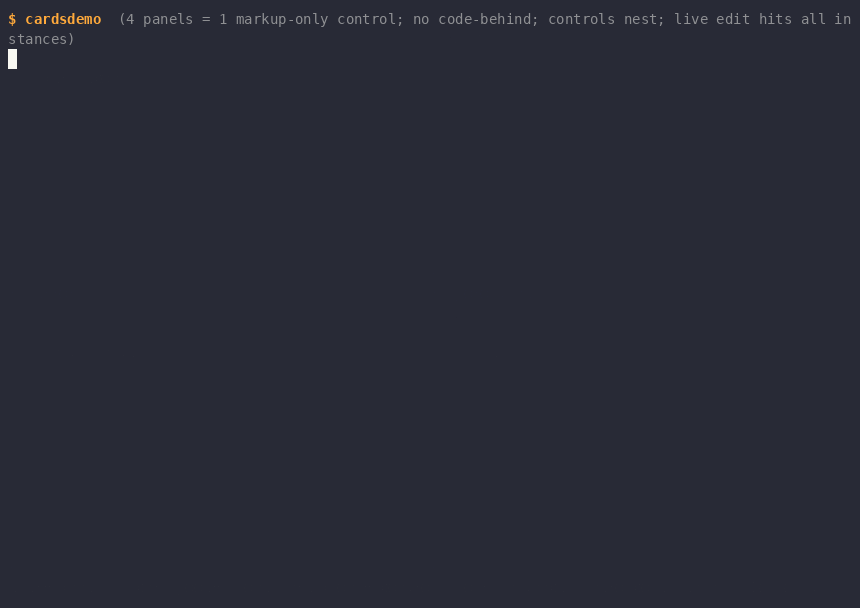

# Demo Catalog

Each demo exercises one slice of the framework; most are recorded as a GIF under `docs/media/demos/`. Most live under `cmd/`, but demos whose dependencies are quarantined in nested modules live with their module: `temporaldemo`, `temporalops` and `wizardui` under `handlers/temporal/cmd/`, `mcpdemo` under `mcp/cmd/`, and `kanbandemo`, `wysiwyg` and `dynamic-activities` under `examples/`. Note: there is no `cmd/markupdemo` — the markup demo is `cmd/markuplog`.

`cmd/browser` launches the demos under `cmd/`, and also lists the smaller finished examples from the tutorials under `docs/learn/examples/` as a second group — those two groups are all it indexes, so the nested-module demos above do not appear in it. Which tutorial teaches the ideas behind each demo is tabulated in [learn/index.md](learn/index.md#demo-catalog).

```sh
go run ./cmd/browser
```

## probe / demo


Retained visual tree + graphics protocol detection (sixel/kitty/iterm2/halfblock).

`probe` reports the terminal's capabilities — size, cell pixel dimensions, and which graphics protocols it supports. `demo` then renders a retained component tree containing an image through the best available protocol, falling back to halfblock rendering.

- Run: `go run ./cmd/probe && go run ./cmd/demo`
- Keys: any key exits; `--mode` forces a protocol; `--dump` prints one frame

Exercises the terminal capability-detection layer (`term`) and the retained-tree renderer's graphics pipeline, which draws an image through the best or forced protocol.

## propdemo


Dependency-tracked properties only repaint what actually changed: hammering an unwatched source produces zero frames, watched bumps render instantly, and each frame repaints only 2 of 8 components.

The walkthrough: for the first ~3 seconds only the 1 Hz tick renders (frames 1-4, events=0). Then 'b' is pressed five times while the detail computed watches source a — no new frames appear until the next tick, when the events counter jumps from 0 to 5 in one hop (frames=5, "watching a = 0 (b is invisible to me)"). Pressing 'a' bumps the watched source and a frame renders instantly. 'm' toggles the watched source to b ("watching b", "a is invisible to me"), after which two 'b' presses render instantly — detail evals climb to 5 and only 2 of 8 components repaint per frame. 'q' quits.

- Run: `go run ./cmd/propdemo`
- Keys: `a`/`b` bump sources, `m` toggle watched, `q` quit

Exercises the dependency-property graph (`prop`) driving the retained tree: the whole scene is one computed property, so frames render only when something the UI actually read has changed.

## logview


Pausing flips the live buffer out of the dependency graph: 69 lines arrived during the pause while the ten frames that rendered were every one of them caused by a keystroke, not by the firehose — and the scroll and filter UI stayed fully interactive against the frozen snapshot.

The walkthrough: ~3 seconds of FOLLOW mode with the log firehose streaming and rendering live — the stats line tracks lines arrived, frames rendered, view evals, and components painted last frame. Space flips the header to PAUSED with `showing 24 lines`, and that count never moves again until the resume: the view is frozen on a snapshot while the stats line shows lines still arriving (24 to 93) and frames rendered creeping only from 26 to 36, one per key pressed. Six presses of 'k' scroll back through the frozen snapshot and End returns to its tail — the pane is a focus stop that owns its own scroll keys, so this works while paused. Pressing 'f' sets `filter: ERROR` and the UI re-renders from the snapshot showing only the 5 ERROR lines; 'f' again cycles to WARN (5 lines), then back to all. Space resumes and a single frame takes the view from 24 lines to 103, the whole backlog at once. 'q' quits.

Note when spot-checking the GIF: a paused UI emits almost no frames, so the PAUSED beat is only 6 of the 53 frames — but 10.2 of the 19.9 seconds. Sampling by frame index will walk straight past it; sample by cumulative delay instead.

- Run: `go run ./cmd/logview`
- Keys: `space` pause/follow, `f` cycle filter (all/ERROR/WARN), `j`/`k` and the arrows scroll (`pageup`/`pagedown` by a screen, `end` re-tails), `q` quit

Exercises conditional dependency recording: pausing flips a branch so the live buffer silently drops out of the graph — the firehose keeps appending with zero renders — and resuming re-records the dependency so the view catches up in one frame.

## markuplog


The markuplog UI is defined in a `.gooey` XML file that hot-reloads on edit: two live sed edits (a title change, then a new Grid row) rebuild the component tree in place while the log buffer, frame counter, and stream all survive untouched.

The walkthrough: the log viewer loads its Grid UI from the page it is given —
`cmd/markuplog/logview.gooey` unless a path is passed — and streams colored log lines (title: logview, hot reloads=0). About 4 seconds in, an off-screen editor seds the file so the Border title becomes "logview ✦ LIVE EDITED" — the status line ticks to hot reloads=1 while lines arrived keeps climbing (52 and counting). ~3.5 seconds later a second sed extends the Grid Rows spec and inserts a new accent Text row ("★ this line was just added in the editor — no restart, buffer intact") above the LogPane — hot reloads=2, lines arrived=84, never reset. 'q' quits cleanly.

- Run: `go run ./cmd/markuplog [path/to/logview.gooey]`
- Keys: `space` pause/follow, `f` cycle filter (ERROR/WARN/all), `q` quit

Exercises the markup loader (`markup`) with hot reload: bindings resolve against the same property-graph viewmodel as logview, and the tree is disposable while the viewmodel properties are the durable thing — so state survives every rebuild.

## finder


A four-property, three-computed dependency graph drives an fzf-style fuzzy finder: typing re-scores the file index live (microsecond match times in the status bar), arrows move a selection property, and the preview pane derives from it — damage tracking repaints only the affected panes.

The walkthrough: finder opens on the repo index (133 files) with a query input, results pane, and preview pane. "compos" is typed character by character and the results narrow live to `composer.go`/`composer_test.go` with orange match highlighting and "2 matched in 54µs" in the status bar. Down-arrow moves the selection and the preview pane follows, switching from `composer.go` to `composer_test.go`. Six backspaces clear the query and all 133 files return. "gooey" is typed — 21 matches ranked by fuzzy score with subsequence highlighting, `cmd/finder/finder.gooey` on top with its own markup in the preview. A down-arrow selects `cmd/reader/reader.gooey`, and enter exits, printing `cmd/reader/reader.gooey` to the shell.

- Run: `go run ./cmd/finder`
- Keys: type to filter, `up`/`down` (or `ctrl-p`/`ctrl-n`) select, click a result row to select it (wheel scrolls the selection), `enter` print selection and exit, `esc`/`ctrl-c` quit

Exercises the full input-to-derived-view pipeline through the dependency graph — query, index, and selection properties feeding scoring and preview computeds — plus damage tracking that repaints only the results and preview panes, all inside a hot-reloading markup shell (`finder.gooey`).

## reader


Three UserControl panes share one input system — tab cycles focus, live network fetches fill each pane, and adding a feed at runtime updates the list and persists to `feeds.opml`.

The walkthrough: reader launches and four default feeds fetch live over the network, filling in with story counts (Lobsters (25), The Go Blog (10), Cloudflare Blog (20)). 'j' selects Lobsters in the feeds pane (initial focus), tab moves focus to the stories pane — the filled-dot focus indicator appears in its title. 'jj' plus enter opens a story and the reader pane fills with title, date, link, and body. Tab back to feeds, 'a' opens the add-feed input, and `https://xkcd.com/atom.xml` is typed character by character. Enter fetches the new feed: xkcd.com (4) appears in the feed list and `feeds.opml` is written. 'q' quits; the shell echoes `feeds.opml` showing all 5 outline entries including xkcd.com.

- Run: `go run ./cmd/reader`
- Keys: `tab` cycle pane, `j`/`k` move, `enter` open story, `a` add feed, `q` quit

Exercises multi-UserControl composition: three `.gooey` controls with their own contexts, data crossing boundaries only through attribute bindings, and the framework's input system — focus stops, per-pane key handling, and `<KeyBinding>`s declared in markup bound to viewmodel commands.

## statedemo


Buttons + checkbox: manual JSON snapshots vs reactive serialization through the property graph.

The walkthrough: a manual serialize goes stale as clicks mutate state; checking auto-serialize swaps the text box to a live computed; from then on every click re-serializes reactively.

- Run: `go run ./cmd/statedemo`
- Keys: click or `tab`+`enter`/`space`, `s` serialize, `q` quit

Exercises the "no code-behind" contract — pure markup with built-in components and all delegates in the viewmodel — and viewmodel-side state serialization, where typed property handles are snapshotted into a plain struct for `encoding/json`.

## cardsdemo



The "just XAML" UserControl demo: every panel on screen is an instance of `card.gooey` — a markup-only control resolved by convention (`ctx.Includes`), never registered, with no code-behind — and `card.gooey` itself instantiates `badge.gooey`, proving markup-only controls nest. The page context has `Values` and `Styles` only: no `Components` map, no setup func anywhere in the app.

The control's contract is *declared*, not implied: four `<x:Property>` elements give `card.gooey` typed, defaulted, partly-required dependency properties. Literals (`Title`, `Caption`) coerce into fresh per-instance sources; bindings (`Value`, `Trend`) pass the dashboard's live handles straight through, type-checked — so four instances of one control show four different ticking data streams, and a misspelled attribute is a load error instead of an attribute nothing reads. This is the `x:Property` spec's canonical consumer ([spec](specs/2026-08-10-markup-declared-properties.md)).

The data stream is declared too: a `<Timer Interval="600ms" Tick="{{.Advance}}" Enabled="{{.Ticking}}"/>` in the page markup drives the metrics ([timerdemo.gif](media/demos/timerdemo.gif) isolates this element). The checkbox's `Checked` shares the same `Ticking` property the Timer's `Enabled` binds, and `Enabled` is read at fire time on the UI loop — so unchecking the box pauses the stream through the property graph, with no start/stop call anywhere.

- Run: `go run ./cmd/cardsdemo`
- Keys: `space`/click toggle the ticking checkbox, `q`/`esc`/`ctrl+c` quit

Exercises markup-declared dependency properties end to end (declaration, type-check, per-instance defaults, strict mode), convention-resolved Includes nesting, and the `<Timer>` element's Composer-owned lifecycle. All three `.gooey` files hot-reload; editing `card.gooey` restyles every card at once, state intact.

## temporaldemo


Two buttons with no delegates: one is an HTTP GET, the other is a Temporal activity executed by a worker on a task queue — in-process by default, on another machine if you start one there.

The walkthrough: pressing `[ net:Get ]` fills the first box from the demo's own loopback server; pressing `[ temporal:Activity Slugify ]` sends `.Input` to a worker on the `gooey-demo` task queue and the returned JSON — including the worker's hostname and pid — lands in the second box; cycling the input and pressing again slugifies the new phrase, because the argument is a handle read at invoke time rather than a value captured at load.

- Run: needs a Temporal dev server; the demo brings its own worker, both from `handlers/temporal/`:

  ```sh
  temporal server start-dev --headless          # shell 1
  go run ./cmd/temporaldemo                     # shell 2
  ```

  The worker runs in-process as a gooey companion, started before the first frame and stopped with the app. To run it out of process instead — the deployment this models — start it yourself and tell the demo not to:

  ```sh
  go run ./workers/temporalworker                # shell 2 (or another machine)
  go run ./cmd/temporaldemo --with-worker=false  # shell 3
  ```

  `TEMPORAL_ADDRESS` and `GOOEY_TASK_QUEUE` override the defaults for both binaries.
- Keys: `tab` move, `enter`/`space` press, `n` net, `t` temporal, `c` cycle input, `q` quit

Exercises handler namespaces end to end: xmlns prefix capture, the `{{ns:Func … | into .Target}}` grammar, registration-as-capability-grant, and the Dispatcher marshaling async completions back onto the UI goroutine. The demo and its worker live in the `handlers/temporal` module rather than `cmd/`, because that is where the Temporal SDK dependency is quarantined — core gooey builds without it.

## temporalops


The Temporal ops dashboard: live visibility data in a TUI, with every Temporal call declared in markup. A query bar speaks Temporal's visibility query language, the execution list is an `ItemsView` over real `temporal.api.*` responses, the status bar counts every match, and the describe pane follows the selection:

```xml
Click="{{temporal:Activity `visibility.Query` .Query .PageSize .PageToken | into .RowsJSON}}"
SelectionChanged="{{temporal:Activity `visibility.Describe` .SelectedWorkflowID .SelectedRunID | into .DescribeJSON}}"
```

The activities are the `packs/temporal-visibility` pack's *convenience layer* — scalar arguments in, protojson text out — because that is exactly what can cross the markup boundary: each argument is a string read from a property at invoke time, and the result is delivered into a string property. The viewmodel (`handlers/temporal/internal/ops`) never talks to Temporal; it parses what the activities deliver (rows projected via `ItemsOf`, the selected row's IDs, the count) and keeps the page-token history that `next`/`prev` replay — the token itself round-trips verbatim as the base64 text protojson made of it.

The walkthrough: the opening fetch fills page one (25 of 30 running executions) and the count; moving the selection describes each execution into the lower pane — `executionConfig`, pending activities, the canonical protojson every other Temporal tool shows; `ctrl+n` follows the response's `nextPageToken` to the 5-row page two; `ctrl+p` replays the remembered token back to page one.

- Run: needs a Temporal dev server; the demo brings its own worker (the visibility pack served as a gooey companion), both from `handlers/temporal/`:

  ```sh
  temporal server start-dev --headless          # shell 1
  go run ./cmd/temporalops                      # shell 2
  ```

  or truly one shell — the dev server as a `CompanionCmd` child process:

  ```sh
  go run ./cmd/temporalops --with-dev-server
  ```

  or workers where the compute is:

  ```sh
  go run ./workers/visibilityworker              # shell 2 (or another machine)
  go run ./cmd/temporalops --with-worker=false   # shell 3
  ```

  `TEMPORAL_ADDRESS`, `TEMPORAL_NAMESPACE` and `GOOEY_TASK_QUEUE` override the defaults for both binaries. Something must be *running* for the list to show — `temporal workflow start --type Anything --task-queue seed-q --workflow-id demo-1` a few times seeds it.
- Keys: type in the query bar, `enter` run, `tab` move focus, `↑`/`↓` select (describes the selection), `enter` on the list re-describe, `ctrl+n`/`ctrl+p` page, `ctrl+r` refresh, `ctrl+c` quit

Exercises the whole phase-2 stack: the visibility pack's scalar convenience activities (the only shapes that survive both markup boundaries — string args in, string result out of the provider's `any`-typed decode), `ItemsView` + `ItemsOf` over protojson rows with the selection-move damage pinned at three paint nodes, markup-built commands invoked from viewmodel intents through their `Name` (run/next/prev are bookkeeping around the same command the button carries), and the visibility worker as a companion.

## wizardui

A terminal that has no application in it. `wizardui` knows how to render gooey markup, how to poll a Temporal query, and how to send a signal — and nothing else. It does not know what a wizard is, what stages exist, or what any button does: every screen it draws arrived as the payload of a workflow query a moment earlier, and every press it handles was described by that same payload:

```xml
<Button Content="approve" Click="{{wf:Signal `approve` | into .Notice}}"/>
```

The workflow *is* the application — UI structure and behavior live in workflow code, versioned and replayed like any other workflow state, and the terminal is a dumb (but themed) renderer. The one thing the client contributes to behavior is the **capability grant**: it registers the workflow handler namespace (`handlers/temporal/workflowui.go`) against one client and one workflow ID, so served markup can signal that workflow and nothing else — it cannot start activities, fetch a URL, or name a different workflow. Delete the `RegisterHandlers` call and the served markup stops loading, naming the URI it wanted. The version/revision split keeps the poll loop cheap: the query answer carries a revision, and the client re-renders only when it changes.

GIF: docs-and-demos workflow; [`handlers/temporal/wizarddemo.gif`](../handlers/temporal/wizarddemo.gif) shows an earlier cut.

- Run: needs a Temporal dev server; the wizard worker runs as a gooey companion by default, all from `handlers/temporal/`:

  ```sh
  temporal server start-dev --headless   # shell 1
  go run ./cmd/wizardui                  # shell 2
  ```

  or truly one shell, with the dev server as a `gooey.CompanionCmd` child process: `go run ./cmd/wizardui --with-dev-server`. Or three shells, the real-deployment shape: `go run ./workers/wizardworker` where the compute is, and `go run ./cmd/wizardui --with-worker=false`. The UI cannot tell the difference.
- Keys: whatever the served markup declares — `tab` moves focus, buttons press with `enter`/`space`, `q` quits via the served page's own binding

Exercises workflow-served markup end to end: markup as *data* crossing a query boundary, the `wf:` handler namespace with its optional `| into` receipt, registration-as-capability-grant scoped to a single workflow ID, and companions (`gooey.Companion` goroutines and `gooey.CompanionCmd` child processes, [spec](specs/2026-08-10-companions.md)) collapsing a three-shell deployment into one.

## mcpdemo


A small gooey app that is also an MCP server: an agent (or any MCP
client) attaches to `http://127.0.0.1:7777/mcp` and reads the live tree,
screenshots the terminal as text, clicks the buttons by name, sets
viewmodel values, types into the text box, and replaces the whole page
with new markup — while the app keeps running and a `Timer` keeps
ticking. The automation surface, the accessibility surface and the
live-edit surface are one protocol.

The point is the pairing: the UI is ordinary markup with `Name=`
attributes and a viewmodel of typed property handles, and the MCP
surface falls out of that with no extra declaration. Names come from
`Name=`, the bindable state IS the Context's `Values` map, and the
commands the buttons already run are the commands an agent invokes.
Nothing in the demo is written for the agent's benefit except the single
`mcp.Serve` call — which is also the whole security posture: opt-in,
loopback-only, no auth, and an MCP client can do anything the keyboard
can.

The walkthrough (every change in the GIF is a tool call from a script):
`tree_snapshot` returns the component tree with names, `screen_text` the
rendered screen, `invoke_command` presses `Increment` and `Cycle`,
`set_value` writes an agent's note into the bound `Note` property,
`focus` + `send_keys` type into the text box the long way, and
`swap_markup` replaces the page out from under the viewmodel — the
counter's value survives, because state lives in the properties, not the
tree.

- Run: `cd mcp && go run ./cmd/mcpdemo -mcp 127.0.0.1:7777` (empty
  `-mcp` disables the server). It lives in `mcp/` because the MCP SDK's
  dependency graph is quarantined in that nested module.
- Keys: `tab` move, `enter`/`space` press, `q` quit — but the keyboard
  is the demo's *second* input device.

Exercises the MCP server end to end: `mcp.Serve` over the root-module
`control` package, every tool marshaled through the Dispatcher onto the
UI loop, and hot-swappable markup as a wire payload
([spec](specs/2026-08-10-mcp-server.md)). [Tutorial 8](learn/08-remote-control.md)
drives this surface step by step.

## kanbandemo + temporal-worker

A real Kanban board — Todo, Doing, Done — that is also an MCP server,
and the target `examples/temporal-worker` pushes generated UI into.

GIF: docs-and-demos workflow.

Each column is a `components.ItemsView` over an ordinary Go slice
(`*prop.Property[[]Card]`); adding, moving and removing cards is
"mutate the slice, `Set` it back", and the view's windowing and row
reuse do the rest. The bottom panel is a hand-rolled two-tab switcher —
an "mcp" tab with the endpoint and tool-usage help, and a "log" tab
showing every raw MCP request/response this server has handled, live,
captured by wrapping the MCP handler at the HTTP layer (which is why the
demo uses `mcp.New` + its own `http.Server` instead of the `mcp.Serve`
convenience). The log pane's `ItemsView` is Go-composed and registered
as a custom `LogPanel` element because its tail-anchored `Scroll` field
has no markup attribute yet.

The worker is the control-plane story run from the other side:
`examples/temporal-worker` is a Python Temporal worker with one
**dynamic activity** that answers to any activity type name a caller
invents, hands the name plus a topic to Claude, and pushes the generated
markup into the running board over `swap_markup` (generation is
constrained to bindingless elements, so the page can never reference a
value the host viewmodel lacks — a bad page would be rejected
atomically). `-with-worker` runs it as a `gooey.CompanionCmd`: started
before the first frame, killed (process group and all) when the app
quits, output redirected to a log file because the app owns the tty
([companions spec](specs/2026-08-10-companions.md)).

- Run: `cd examples/kanbandemo && go run . -mcp 127.0.0.1:7778` — its
  own module, for the same dependency-quarantine reason as `mcpdemo`.
  With the worker companion (needs a Temporal server and a Python venv
  with `examples/temporal-worker/requirements.txt`):

  ```sh
  go run . -mcp 127.0.0.1:7778 -with-worker -worker-python /path/to/.venv/bin/python
  ```

  then trigger it from `examples/temporal-worker`:
  `TEMPORAL_TASK_QUEUE=kanbandemo-dynamic-ui python trigger.py GenerateUI "some topic"`.
- Keys: `tab` move focus, type in the input and `enter` adds a card,
  each column's buttons move/remove the selected card, `ctrl+t` (or the
  `[ MCP ]`/`[ Log ]` header buttons) flips the bottom tab, `q` quit

Exercises `ItemsView` as a real list surface (three views, shared
selection properties, `SelectionChanged`-free navigation), `Visibility`
bindings as a tab mechanism with no structural rebuild, the MCP surface
under instrumentation, and `gooey.CompanionCmd` collapsing a
hand-managed sidecar into the app's own lifetime. It is the app
[Tutorial 8](learn/08-remote-control.md) drives.

## wysiwyg

GIF: docs-and-demos workflow.

A terminal UI builder that edits gooey markup, laid out the way VS Code is: an activity rail, a side bar, the designer, a properties pane, a bottom panel and a status bar. It is the component catalog's first real consumer, and it exists to test the SHAPE of that surface against running code rather than to be a finished editor.

Three claims from the catalog spec are exercised here rather than asserted. The palette is `(*markup.Context).Catalog()`, and an element whose attributes are *not* knowable renders differently from one that simply takes none — a registered component is kept in the list so that case is visible rather than theoretical. The inspector is `markup.AttrsFor(spec, parent)` and never `spec.Attrs`, which is a true statement about the element and a misleading answer to "what can I set here". And attached properties are scoped to the PARENT: retype the container between `<Canvas>` and `<VStack>` and `Canvas.Left` enters and leaves the selected child's attribute list, which is the rule a flat per-element list cannot express and the one whose absence would have the editor offering positioning that `applyLayout` silently discards.

Every region in `wysiwyg.gooey` carries a `Name`, and that is the working method rather than documentation: each name is a `patch_markup` address, so a region can be replaced in the running editor without touching the others. The editor SERVES its own gRPC control plane and MCP endpoint as well as ATTACHING to another app's — opposite directions on one protocol — which is what lets the next iteration of its own UI be patched in while it runs.

Two layout facts in the page are bug fixes with the failure written next to them. The properties pane is a `<Grid>` with declared tracks rather than a `<VStack>`, because `ItemsView` measures greedily: as a VStack the list took every row and the edit row underneath it was arranged at W:0 H:0 past the bottom of the panel — the keystrokes worked, the input was simply invisible. And the `TextBox` lives in the properties pane rather than in the designer, because the designer's subtree is thrown away and rebuilt on every edit and a caret is component-local state; being a *sibling* of the designer is what keeps it from losing the caret mid-word.

- Run: `cd examples/wysiwyg && go run .` — it is a nested module, so the root `./...` does not build it; `-attach 127.0.0.1:7777 -island Body` drives another app's control plane instead of previewing locally, `-serve`/`-mcp` set this editor's own endpoints (empty disables), `-graphics sixel|kitty|iterm2|cells` forces a pixel protocol
- Keys: `ctrl+n`/`ctrl+p` next/previous element, `x` delete, `q`/`ctrl+c` quit; the bindings live on the page ROOT because a `KeyBinding` only fires while the focused chain passes through its host

Exercises the catalog as a public surface, `patch_markup` as an addressing scheme, and the panel chrome drawn as pixel line art sliced into a ring so the interior stays on the cell plane where a terminal draws text best — falling back to the same shape in box-drawing runes where there is no pixel protocol.

## dynamic-activities

A star button that runs Python written *after* the app started.

> **This demo executes arbitrary supplied code, unsandboxed, on purpose.**
> Everything binds loopback only and nothing is authenticated. Read
> `examples/dynamic-activities/README.md` before running it.

One companion process is both a Temporal worker and an MCP server, and
that MCP server's tools are CRUD over the worker's own activities.
`create_activity(name, code)` execs a blob of Python source into a
callable and puts it in a runtime registry; the worker's ONE registered
activity is a dynamic dispatcher (`@activity.defn(dynamic=True)`) that
answers to any activity type name and looks it up there — so an activity
becomes runnable on a running worker with no redeploy and no restart.

The same tool call then reaches back into the terminal over **one
`SessionService.Attach` stream** held open for the worker's lifetime:
`RegisterProperties` a result property `Activity.<Name>.Result` and
`SetProperty` the app's `Selected`, both as acts applied in stream order
on the UI goroutine, plus one unary `PatchMarkup` (the only op the `Act`
oneof lacks) putting a button per activity into the page's
`ActivityList` element, each bound to ``{{temporal:Activity `<Name>`
.Input | into .Activity.<Name>.Result}}``. `delete_activity` runs it
backwards and ends with the `UnregisterNames` act, which exists because
of this demo: without it every invented name leaks for the life of the
process.

The stream is what makes this state *sync* rather than hopeful writes.
The worker subscribes to `properties` (filtered) and `lifecycle`, so it
has a live mirror of the app's side: pressing ctrl+n in the terminal
moves `Selected` with no tool call involved, and the worker sees it — a
delete repoints the selection only when it has actually gone dangling,
and `run_activity` with no argument sends whatever is in the input box.
A `Swapped` event means the page was replaced, so the worker re-patches
its buttons onto the new one; a `Closing` event stops it cleanly.

The framework point: commands still cannot be registered over the
control plane — behavior needs code, not storage — but the `temporal:`
handler namespace lets markup bind an activity *call*, and the activity
is the behavior, so a property plus a markup patch is enough to make a
new button that runs new code. The hero button goes further: its
activity type name is a **bound path**, not a backtick literal
(`Click="{{temporal:Activity .Selected .Input | into .Output}}"`), and
`markup.Arg` holds the property handle and reads it at click time — so a
button built at startup runs whichever activity was invented most
recently, with no rebinding at all.

The star itself is a `Canvas` raster: one background-filled container per
run of cells, positioned with the attached `Canvas.Left`/`Canvas.Top`,
every run bound to the same two registered color properties. The
`<Button>` comes after the runs it sits on, because paint order is tree
order and hit-testing is topmost-first.

**The pages pin their own pixel protocol.** `dynamicactivities.gooey` and
`zoom.gooey` both carry `<Gooey Graphics="halfblock">`, which is the
document-level setting rather than a launch flag: the choice belongs to the
artwork on the page, not to whoever started the process. That matters here
because this demo is recorded — under a recording pty, capability detection
answers for the pty rather than for a real terminal, so a page that left the
decision to detection would record as something other than what it is. The
counterpart is `three-ways.svg`, decoded through `imagefmt/svg` and pushed
over the control plane as an `image` value: the one kind with no markup
literal, bindable through `<Image Src="{{...}}">` and not writable inline.
`zoom.gooey` is the page that shows it large.

- Run: `cd examples/dynamic-activities && go run .` — its own module,
  same dependency-quarantine reason as `mcpdemo` and `kanbandemo`, and
  it needs a Temporal server plus a Python venv (see its README).
- Keys: `tab` move focus, `enter`/`space` press, `ctrl+n` cycle which
  activity the star runs, `ctrl+l` clear the result, `ctrl+c` quit.

Exercises handler namespaces with a *dynamic* activity name, the
streaming session (`Attach`: subscribe, acts, frame deltas, lifecycle)
as a real client's primary surface, the control plane's registration
CRUD pair, `PatchMarkup` from a non-Go client, `Canvas` absolute layout
with bound backgrounds, and `gooey.CompanionCmd` giving a Python process
the app's lifetime.

## colordemo


Absolute layout, capability-adaptive color, and a component whose experience changes with the terminal.

The walkthrough: the `ColorPicker` edits one `Accent` property; the border, title, and swatch cascade are all styled by a computed `render.Style` over it, so moving a channel restyles the page through the property graph. The page is a filled surface — `Background="#12121e"` on the Border, painted by the framework, with every leaf pre-clearing against it. Everything inside the frame is placed by a `Canvas` — the picker, the tier strip, and a cascade of swatches at absolute coordinates that deliberately overlap, later siblings painting over earlier ones (safe under damage tracking: the Composer's z-ordered repaint restores the stack when an occluded swatch repaints alone). The tier strip draws one gradient three times, pre-approximated to each color depth with the same function the flush uses, so a single terminal shows what all three classes of terminal would do.

The GIF runs the demo twice, `--depth=truecolor` and then `--depth=256`, driven by identical keystrokes so the two tiers can be compared at the same color: the truecolor pass shows smooth bars, a wide swatch, and a bare `#FFAA3C`; the 256 pass shows banded bars, a narrow swatch, and `#FFAA3C → xterm 215`. On a 16-color terminal the bars stop pretending to be gradients at all and become a fill meter with `≈ yellow`.

There is a fourth tier the GIF can never show. On a terminal with a
graphics protocol and a known cell size, each channel bar records **one**
`Frame.Place` of a gradient image generated at the terminal's exact
pixels-per-cell — the same sweep `renderBar` paints per cell, drawn per
pixel instead. The marker is baked into the bar image rather than
overlaid, because overlapping placements have no reliable stacking on any
protocol; a channel move is therefore a replace of that one bar under its
existing id, and a state-identical repaint reuses the cached image and
costs zero bytes on the wire. The cell tier is byte-identical to what it
always was — the pixel tier is purely additive, which is what lets the
cell buffer stay the thing a protocol without placement identity
repaints from. Recording under a pty always yields the cell tier (agg
renders the cell plane only), so `--graphics=kitty|sixel|iterm2|cells`
forces the tier for verification and the status line names the one in
play. Ground truth: [the ColorPicker pixel-tier
spec](specs/2026-08-10-colorpicker-pixel.md).

- Run: `go run ./cmd/colordemo`, `--depth=truecolor|256|16` to force a
  color tier, or `--graphics=kitty|sixel|iterm2|cells` to force the pixel tier
- Keys: `↑`/`↓` channel, `←`/`→` adjust (shift = ×16), `home`/`end` saturate, click or scroll a bar, `q` quit

Exercises the `Canvas` panel and its `Canvas.Left`/`Canvas.Top` attached properties, depth-aware SGR emission (`38;2` / `38;5` / `30-37`) with the buffer staying 24-bit throughout, capabilities reaching components through `Frame.Caps`, and bound `Style` attributes as the closest thing gooey has to theming.

## toolkitdemo


Every component the kit ships, alive at once and spelled entirely in markup — the catalogue page, and the one demo whose job is coverage rather than a story. Thirty components on one flat screen is a wall, so they are organized under a `<Tabs>` into six pages: **job** (`ProgressBar`, `Spinner`, `Toggle`, `Segmented`, `ButtonBar`, `Button` in both chromes, `Tooltip`), **basics** (`Border`, `VStack`, `Grid`, `Text`, `TextBox`, `Checkbox`), **data** (`Gauge`, `Sparkline`, and an `ItemsView` with an `<ItemsView.ItemTemplate>`), **visual** (`Canvas`, `ColorPicker`, `Image`), **forms** (`<Validate>` behaviors, inline error `Text`s, a floating `ValidationMarker`), and **overlays** (`Popup`, through the one owner this demo writes in Go). The page chrome — `MenuBar`, `StatusBar`, `ToastHost`, `AdornmentLayer` — plus the `Timer`s and `KeyBinding`s live *outside* the tabs, because they belong to the app rather than to any one page, and because an overlay declared inside a collapsed tab would be collapsed along with it.

The walkthrough: the job opens in its fetch stage, which has no measurable progress — so the `ProgressBar` marches a band instead of claiming a number and the `Spinner` turns beside it, while the pixel `Button` shows the three-row pill it draws where a graphics protocol exists. `ctrl+pgdn` moves to **basics**, where typing into the `TextBox` updates the bound `Text` above it a keystroke at a time and the `Checkbox` unticks the job tab's captions — a bool bound to `Visibility`, so the rows leave *layout* rather than blanking. On **data**, `↓` walks an `ItemsView` whose template renders this very catalogue (the kit describing itself), the detail `Border` beside it tracking the selection, and `enter` toasts the row. On **visual**, the `ColorPicker`'s channels drive one `Accent` property that a swatch, a `Style`, and the `Image`'s `Src` all read — the gradient is a *computed* `image.Image`, so moving green regenerates it. On **forms**, a short name and a junk address hold their inline errors until they pass, and the over-long tag floats its message through the `AdornmentLayer` instead of taking a row; `[ submit ]` un-greys itself the moment the gate computed over the published error properties turns true. On **overlays**, `ShowFor` with a negative duration puts up a toast that never expires and `Dismiss` takes it back down, then the preset picker drops a `Popup` list over the page, commits a colour into the same property the visual tab edits, and re-opens from a `Button` that does not own it — `esc` dismissing it restores the covered cells exactly. `ctrl+pgdn` wraps back to the job, where the log line reads `accent preset → orchid`: the popup's commit reached the viewmodel a whole page away.

- Run: `go run ./cmd/toolkitdemo`, or `--mode=kitty|sixel|iterm2|cells` to force the pixel button's chrome, `--hold=15s` to exit unattended
- Keys: `ctrl+pgdn`/`ctrl+pgup` next/previous tab from anywhere, `←`/`→` on the strip itself, `tab` move focus, `enter`/`↓` open the focused menu or popup, `esc` close it, `space` toggle, `ctrl+s`/`ctrl+x`/`ctrl+r` start/abort/reset, `ctrl+t` toast, `q` quit; hovering a button shows its tooltip, and clicking a tab header selects it (the GIF is keyboard-only — everything here is operable without a pointer, which is what makes it recordable)

Exercises the toolkit end to end: the Startable animation discipline shared by `ProgressBar`, `Spinner`, the toast auto-dismiss timers and the tooltip delay (post, never touch the graph from the goroutine; stop closes and joins), rocker arrow semantics that consume a key only when it moves something, `ButtonBar` uniform sizing and its `gooey.FocusHost` focus scope, pixel button chrome placed per paint node, `Validate` behaviors publishing error properties a computed can gate a command on — and the overlay story: document order is z-order, so the `MenuBar`, `ToastHost` and `AdornmentLayer` are declared as the root Grid's *last* children while `Grid.Row` keeps the bar on the top row, the open menu holds the pointer capture so a click elsewhere dismisses without activating what is underneath, and dismissing any overlay — menu, toast, tooltip, or popup — repaints exactly the components it was covering (the Composer's restore pass).

Tabs made this the demo that stresses *collapse*, and the reorganization found three framework bugs doing it. A `Grid` arranged into a zero rect was returning off a stale measure cache, so its children kept the bounds they had; the Composer erases a component by noticing its bounds *changed*, so a hidden page's whole subtree stayed painted over the page that replaced it. `Border` and `Gauge` painted a row at their own `Y` without checking they had one, putting cells outside their damage rect where no sweep could reach them (`Border` worse than most: at zero width its far-edge arithmetic walks backwards). And every stack panel indexed a per-child measure cache that a collapsed-on-first-frame container never fills, which panicked. All three are pinned — `components/layout_test.go` for the layout and paint contracts, `cmd/toolkitdemo/toolkit_test.go` for the screen-level one, which composes each tab from scratch and demands it be byte-identical to the same tab reached by switching.

The demo page carries two layout budgets that are also pinned, because both failures are invisible until they are on screen: the `ValidationMarker` gets an empty *fixed* row of its own on the forms tab (an `Auto` row with no children sizes to nothing, and the adornment plane paints above everything, so the marker simply erased `[ submit ]`), and the three `StatusBar` sections have to fit 96 columns — Left and Right size to their content and Center is centred in what is left, so a key-hint string that grows takes the clock's breathing room first and then collides with the status text.

The GIF is recorded under a pty, which reports no graphics protocol, so the pixel button is showing its universal tier: the same three-row pill drawn in box-drawing runes. That is the honest result of recording, not a fallback the component reaches for by accident — the pixel tiers are verified separately, by driving the demo with `--mode` and checking the protocol bytes in the captured log.

## typeaheaddemo

GIF: docs-and-demos workflow.

`<TypeAhead>` — Windows Explorer's type-ahead find — on a list whose rows are PICTURES, to find out what Explorer semantics feel like when a row's identity is art rather than a line of text. Type a letter and the selection jumps to the first record whose title begins with it, in the list's *current* sort order, wrapping at the end; repeat the letter to cycle through the records that start with it, and pause a second and the buffer is dropped. Nothing is ever filtered and no row is ever hidden, which is what makes "any movement resets the search" coherent.

`TypeAhead` is a *behaviour attachment*, not a component, and that is the whole reason it can do this: attachments are offered keys before the host view sees them, so `j` and `k` reach the search even though `ItemsView` binds both as movement. The trade is stated rather than hidden — this list has no vim navigation, because the letters went to the search.

Three things are hard to see on a list of text rows and obvious here. Image rows are TALL: a cover is four cells high, so a terminal shows six or seven of them, and a jump you cannot see the neighbours of is a teleport — the status line under the list is the only thing telling you where you landed. A jump that leaves the visible window re-realizes every row, so one keystroke re-transmits a screenful of pictures, and the footer reports both currencies of that, components repainted and bytes written. And `Key="Title"` is fixed at load time rather than bindable, so sorting by artist with `ctrl+s` still searches titles — which is why the status line names the column being searched.

Two decisions in the page are measurements rather than taste. The item template mentions the reserved `_selected` value, which turns off `ItemsView`'s house highlight and draws a marker column instead: the house highlight re-styles the row's *cells* as Reverse, and a cover's cells are either empty (a graphics protocol paints over them, so the highlight is invisible) or the picture itself (halfblock, so the highlight photo-negatives the art). And the root `<Grid>` deliberately declares no `Background`: the selection marker flips `Visibility`, which makes the Composer restore everything under the marker's rectangle, and a restored ancestor that declares a background is `covered` — which forces its whole subtree to repaint above it. Adding `Background="#141420"` there takes a selection hop from 7 repainted components to 48, pinned by `TestABackgroundAncestorAmplifiesTheSelectionMarker` in `cmd/typeaheaddemo/background_amplification_test.go`.

- Run: `go run ./cmd/typeaheaddemo`, or `--mode=kitty|sixel|iterm2|halfblock` to force a protocol, `--dump` for one frame to stdout, `--hold=3s` to exit unattended
- Keys: type a letter to jump, `↑`/`↓` move and reset the buffer, `esc` drop the buffer, `ctrl+s` cycle the sort column, `ctrl+r` reverse the sort, `ctrl+q` quit

Exercises the attachment key seam (attachments beat the host's own `HandleKey`, which is what no number of `KeyBinding`s could express), `ItemsView` row realization over pixel content, and the background/damage interaction above. It is also why every accelerator on the page is a *modified* key: `KeyBinding`s are offered a gesture before behaviour attachments are, so a binding on a bare letter would take that letter out of the searchable alphabet permanently, silently, and with no error anywhere.

## browser

The front door: a launcher that lists every demo under `cmd/` and every
tutorial example under `docs/learn/examples/` as two labeled groups, shows a
preview of the selected entry, and hands the terminal to whichever one you
run — taking it back when the program exits.

The preview pane is itself a small showcase: if the selected entry's
directory has a `README.md` it renders **as markdown** (styled headings,
bold, inline code, fenced blocks, bullets, underlined links — see
`cmd/reader/README.md`); otherwise the entry's `main.go` doc comment is
shown. If a recording exists (`recordings/<name>.gif` or a checked-in
GIF under `docs/media/demos/`),
`p` plays it in the pane — decoded with `image/gif`, frames coalesced, and
animated as halfblock cells at the GIF's own frame delays; the animation
stops on selection change and before every hand-off. The whole listing is
live: the browser watches `cmd/`, the example directories, and
`recordings/`, so a new demo, an edited README, or a recording created
while it runs appears without a restart (recordings are marked ● gif / ○
cast and feed the info pane; ▶ marks an entry playable from a GIF outside
`recordings/` — the checked-in ones under `docs/media/demos/`).

`r` records the selected entry: the run is wrapped in `asciinema rec`
(the demo drives the recorded terminal) and converted to a GIF with `agg`
when available — artifacts land in `recordings/` and immediately show up
in the listing.

Two groups is all it indexes: `cmd/` and the tutorial examples under
`docs/learn/examples/`. The nested-module demos — `temporaldemo`,
`temporalops`, `wizardui`, `mcpdemo`, `kanbandemo` — are absent by
construction, because each has to be run from inside its own module's
directory so its `go.mod` graph applies.

The tree being browsed doesn't have to be the tree the browser was
launched from. `b` opens a **source picker**: every worktree of the
repository (name, tip subject, `*` when it has tracked modifications) and
every local branch that has no worktree. Picking a worktree switches to
it; picking a bare branch materializes a throwaway **detached** worktree
under the system temp dir and browses that — so you can flip between a
demo on `main` and the same demo on a feature branch without touching
either checkout. The demo list, README/GIF previews, the watcher, `enter`
and `r` all resolve against the selected source (nested-module demos keep
working — `go run` happens in the source's own root, so its `go.mod`
graph applies); demos that don't exist on an older branch simply don't
appear. Two things deliberately stay anchored to the launch tree: the
browser's own UI, and `recordings/` — a recording is an artifact you
keep, and the ephemeral worktree it was made from is deleted on
switch-away and on exit (`git worktree remove` + `prune`; ctrl+c included,
since cleanup runs before the exit signal is re-raised). Real worktrees
are only ever read — never checked out, never written.

- Run: `go run ./cmd/browser` (from anywhere in the repo)
- Keys: `j`/`k` or arrows select (click/wheel too), `enter` run, `r`
  record, `p` play/stop a recording, `b` sources (then `j`/`k` select,
  `enter` switch, `esc` close), `q`/`esc` quit

Exercises the `fs.FS` seam as a live data source, `gooey.App.Suspend` for
the terminal hand-off (the tty read-lifecycle invariant is what makes the
child's stdin safe), the Startable/dispatcher lifecycle for the GIF
animation (the preview component owns a ticker that posts frames through the
dispatcher and is joined on stop — the same discipline as `<Timer>`, not
the element itself),
the damage system — an animation tick repaints exactly one component, and
the picker's damage is pinned too (open paints the overlay, navigation
repaints the popup alone, dismissal restores exactly what was covered) —
and the MenuBar overlay recipe reused in an app: last-in-document-order
z-order, modal focus with key swallowing, pointer capture while open,
focus restored on dismiss. All git work (enumeration, `worktree add`
/ `remove`) runs on one worker goroutine and marshals back through the
dispatcher, per the UI-confinement rule.

## settingsdemo

External state as ordinary properties: the three settings the browser
wants — last source, keep-recording, auto-restart — persisted through
the `settings` store and bound straight into markup. The checkboxes are
bound to `*prop.Property[bool]` handles, the source line to a
`*prop.Property[string]`, and none of the markup knows those handles
came off disk. Toggle one and the setting is written; quit and relaunch
and it is still set.

The `writes` counter on screen is the honest measure of what a setting
costs: the demo's Provider wraps the file-backed one only to count
`Save` calls and report them to the UI — posting, never touching the
counter property directly, because `Save` runs on the store's writer
goroutine. Hammer `r` and `a` and the counter rises once per keystroke;
several toggles landing in one dispatcher batch cost one write; a
setting toggled and toggled back within a batch costs none. Launch and
quit without touching anything and it stays at zero, because a value
equal to its default is absent from the document and an unchanged
document is never re-saved.

- Run: `go run ./cmd/settingsdemo`
- Keys: `s` cycle the source, `r`/`a` toggle recording / auto-restart, `n` toggle a setting and toggle it straight back in one batch (proving the round trip costs no write), `d` reset to defaults, `q` quit

Exercises the settings store (dirty-tracked deferred saves, the
computed-watcher over each handle, close-and-join teardown),
host-supplied persistence through the `Provider` seam, and the
UI-goroutine confinement rule in the layer where a host would actually
get it wrong.

## sysmon

A live system monitor over real `/proc` data — per-core CPU gauges, a
memory gauge, a total-CPU sparkline, and a process table sortable by CPU
or memory.

It is the demo where the extracted visual components earn their keep:
the gauges and the sparkline are the framework's own `components.Gauge` and
`components.Sparkline` (they were written here first, then promoted), with
threshold coloring driven by the sampled values. Every displayed number
flows through a dependency property, and the sampler only `Set`s values
that actually changed — so on an idle system a 700ms tick repaints
almost nothing, and the damage counter proves it. The process table was
the DataTemplates epic's target consumer, and it now rides
`components.ItemsView` with a Go-composed row template — the sort keys
stay demo-local, the list machinery does not.

- Run: `go run ./cmd/sysmon`
- Keys: `c`/`m` sort the process table by CPU / memory, `q` quit

Exercises viewmodel-side dedup against the property graph (Set only on
change), the promoted Gauge/Sparkline components, threshold styling,
and a screen-wide composition sampled from a real, noisy data source.
