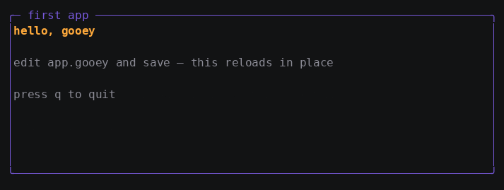

# Tutorial 1: Build your first gooey app

In this tutorial you build a complete gooey application from an empty
directory: a markup file that describes the UI, a Go file that supplies
the state and starts the app, and a live edit that reloads the running
app without restarting it.

**Time:** about 15 minutes.

When you finish, you will have this:


The finished code is in
[`docs/learn/examples/01-first-app`](examples/01-first-app).

## Prerequisites

- Go — the version in [`go.mod`](../../go.mod) or newer.
- A real terminal. gooey apps open `/dev/tty` directly and exit with
  `no tty:` if there isn't one, so they do not run under an IDE's output
  pane or a piped shell.

## Step 1: Create the project

```sh
mkdir hello && cd hello
go mod init hello
go get github.com/WonderForgeLabs/gooey
```

## Step 2: Describe the UI in markup

Create `app.gooey`. A `.gooey` file is XML: elements are widgets,
attributes are properties, and `{{.Name}}` is a binding into the data
your Go code supplies.

```xml
<Gooey xmlns="wonderforge.io/gooey/2026">
  <Border Title="first app" Style="panel">
    <VStack Gap="1">
      <Text Style="accent">{{.Greeting}}</Text>
      <Text Style="dim">edit app.gooey and save — this reloads in place</Text>
      <Text Style="dim">press q to quit</Text>
    </VStack>
    <KeyBinding Gesture="q" Command="{{.Quit}}"/>
    <KeyBinding Gesture="ctrl+c" Command="{{.Quit}}"/>
  </Border>
</Gooey>
```

Four rules are in play here, and all four are enforced when the file
loads:

- The root element is always `<Gooey>`, with exactly **one** child.
- `<Border>` wraps exactly one visual child. `<KeyBinding>` is not
  visual, so it does not count against that limit.
- `Style="panel"` is a **name**, looked up in a table you register in Go.
  It is not a color and not a stylesheet.
- `{{.Greeting}}` and `{{.Quit}}` must resolve against your data at load
  time, or the load fails with an error naming the path.

> **If you know XAML:** `<Gooey>` plays the part of `<Window>` or
> `<UserControl>`, `VStack`/`HStack` are `StackPanel` with
> `Orientation`, and `<KeyBinding>` is the direct analogue of
> `<Window.InputBindings><KeyBinding .../></Window.InputBindings>` —
> minus the ceremony, because gooey attaches it to whatever element
> encloses it.

### Why the KeyBindings sit on `<Border>` and not on `<VStack>`

Key dispatch starts at the focused widget and walks **up** to the root,
firing bindings attached along the way. This page has no focusable
widgets yet, so dispatch starts at the root element itself and the only
bindings it can reach are the ones attached there.

Move those two `<KeyBinding>` elements inside `<VStack>` and `q` stops
working — the walk never descends into the stack. Once your page has a
focus stop (a `Button`, from tutorial 4 on), bindings anywhere on the
path from that button to the root are reachable. Until then, put
page-global bindings on the root element.

## Step 3: Supply the state and run the app

Create `main.go`. It has three parts: a viewmodel, a `markup.Context`
that exposes it to the markup, and the app that runs it.

```go
package main

import (
	"context"
	"os"

	"github.com/WonderForgeLabs/gooey"
	"github.com/WonderForgeLabs/gooey/markup"
	"github.com/WonderForgeLabs/gooey/prop"
	"github.com/WonderForgeLabs/gooey/render"
)

func main() {
	// --- viewmodel: the state and the commands markup binds to ---
	var app *gooey.App
	greeting := prop.NewSource("hello, gooey")

	ctx := &markup.Context{
		Values: map[string]any{
			"Greeting": greeting,
			"Quit":     gooey.Command(func() { app.Quit() }),
		},
		Styles: map[string]render.Style{
			"panel":  {Fg: render.RGB(120, 90, 220)},
			"accent": {Fg: render.RGB(255, 170, 60), Bold: true},
			"dim":    {Fg: render.RGB(140, 140, 150)},
		},
	}

	// --- the app ---
	app = gooey.NewApp(markup.Page(os.DirFS("."), "app.gooey", ctx))
	if err := app.Run(context.Background()); err != nil {
		gooey.Exit(err)
	}
}
```

Run it:

```sh
go run .
```

You should see the panel from the top of this page. Press `q` to quit —
or `ctrl+c`, which the framework maps to quit for you.

> **Why `var app *gooey.App` before the context?** The `Quit` command
> needs to call a method on the app, and the app needs the context to
> build its tree. Declaring the variable first and assigning it later
> breaks the circle without any indirection: by the time anything can
> press `q`, `app` is assigned.

> **Troubleshooting.** `gooey: no terminal:` means the process has no
> terminal — run it directly rather than through a pipe or an IDE
> console. `markup: "Greeting" not found in context` means the name in
> the markup and the key in `Values` disagree; the two are matched by
> exact string.

## Step 4: Understand what the App does for you

Four lines start a terminal application. Here is what each one carries.

**`markup.Page(fsys, name, ctx)`** is the app's *content*: where the
widget tree comes from. It reads the file from any `fs.FS` and builds
the tree, and it re-reads it when the file changes. Bindings resolve
**at build time**, once, into property handles — the built widgets hold
the handle, not a copy of the value, and rendering never looks anything
up.

**`gooey.NewApp(content)`** creates the application. It touches no
terminal and starts no goroutine yet, so you can register hooks on it
first (later tutorials do).

**`app.Run(ctx)`** owns everything for the duration:

| It owns | What that means |
|---|---|
| The terminal | Raw mode, alternate screen, mouse reporting on, and all of it undone on the way out — including after a panic, which restores the screen *before* printing its stack |
| The input decoder | tty bytes become `input.Event` values (keys and mouse on one ordered stream), with escape ambiguity — a lone Esc versus the start of an arrow key — resolved by a 40 ms idle timeout |
| The Composer | Every widget gets its own node in the property graph; whatever a widget reads while painting becomes that widget's repaint trigger, automatically |
| Frame scheduling | A `Set` on a property some widget painted from marks that widget dirty and asks for a frame. Dirty flags accumulate and evaluation is lazy, so twenty `Set`s between frames collapse into one repaint |
| Hot-reload swaps | When the content reports a change, the tree is rebuilt and the composition replaced |
| Signals | `ctrl+c` quits; `SIGINT`/`SIGTERM` restore the terminal and exit with the conventional code; `SIGWINCH` resizes and repaints; `ctrl+z` suspends and comes back intact |

**`gooey.Exit(err)`** applies the exit-code convention: nothing to say
for a normal quit, 128+n for a signal, and the message on stderr with
exit 1 for a real error.

Two rules are worth knowing now, because they explain later behavior:

- **The tree gets input first.** `ctrl+c` quits only if no widget
  claimed it, exactly like an unconsumed arrow key moving focus.
- **Everything runs on one goroutine.** Commands, property `Set`s and
  rendering all happen on the loop, which is why properties are
  unsynchronized by design. Background work hands results back through
  `app.Post` (see
  [how-to: work off the UI goroutine](howto/howto-async.md)).

> **If you know XAML:** `app.Run(ctx)` is `Application.Run()`, and
> `app.Post` is `Dispatcher.Invoke`. The differences are that the
> content — not a `StartupUri` — is what the app is given, and that
> there is no separate `Window`: the page fills the terminal.

## Step 5: Edit the running app

Leave the app running. In another editor, change `app.gooey` — retitle
the border, add a line, change a style name — and save.



The UI rebuilds in place. The page polls the file's ModTime every 300 ms
and, on a change, tells the App — which does the rebuild itself, on the
UI goroutine. That last part matters: building a tree resolves bindings
against your properties, and properties may only be touched from the
loop, so the watcher reports *that* something changed and never hands
over a tree it built on its own goroutine.

Two things make this safe rather than clever:

- **State survives** because it lives in the properties in your
  viewmodel, not in the widgets. The tree is disposable; `greeting` is
  not.
- **A broken edit is harmless.** If the file does not parse, the reload
  is skipped and the running tree stays up. Fix the file, save again.

The Composer is rebuilt rather than patched — it is a static-tree design,
so structural change means a new Composer, which is exactly what the App
does on every swap.

## What you learned

- A gooey UI is a `.gooey` XML file plus a `markup.Context` that supplies
  values, commands, and named styles.
- Bindings resolve **once at load time** into property handles, so
  rendering does no lookups.
- `gooey.App` owns the terminal, the input decoder, frame scheduling and
  the signal story; `markup.Page` is the content it runs.
- The Composer gives each widget its own paint node, and a property
  `Set` is the entire scheduler.
- `KeyBinding` fires only if the focused widget's path to the root passes
  through the element it is attached to — with no focus stops, that means
  the root.
- Hot reload keeps state because state is not in the tree.

## Current limitations

- The watcher is 300 ms ModTime polling, not an OS file-watch API.
- `Style="name"` is a lookup with no cascading, selectors, or overrides.

## Next steps

- **[Tutorial 2: Lay out a page with Grid](02-layout.md)** — Fixed, Auto,
  and Star tracks, and the layout attributes every element accepts.
- Concept: [the property graph](concepts/property-graph.md) ·
  [damage tracking](concepts/damage.md)
- Reference: [markup-reference.md](../markup-reference.md)
