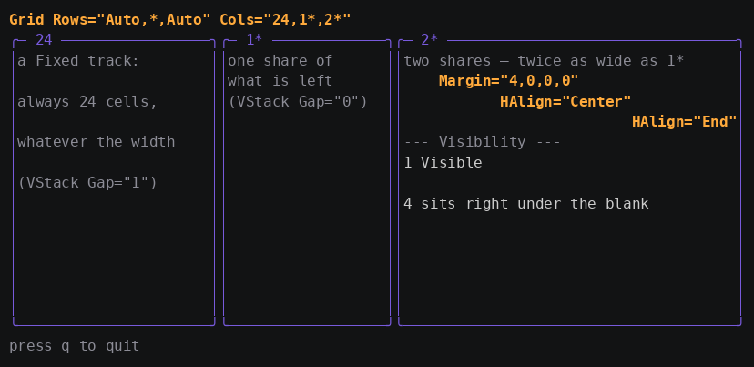

# Tutorial 2: Lay out a page with Grid

In this tutorial you build a three-column page with a `Grid`, size the
columns with Fixed, Auto, and Star tracks, and control individual
elements with the layout attributes every gooey element accepts.

**Time:** about 20 minutes.
**Prerequisites:** [Tutorial 1](01-first-app.md).

When you finish, you will have this:



The finished code is in
[`examples/02-layout`](../../examples/02-layout). Everything in this
tutorial happens in `app.gooey`; the Go file is tutorial 1's, unchanged.

## Step 1: Declare the grid

Replace the body of `app.gooey` with a `Grid`. Rows and columns are
declared on the grid; children say which cell they go in.

```xml
<Gooey xmlns="wonderforge.io/gooey/2026">
  <Grid Rows="Auto,*,Auto" Cols="24,1*,2*">
    <Text Grid.Row="0" Grid.ColSpan="3" Style="accent">a header spanning all three columns</Text>
    <Text Grid.Row="2" Grid.ColSpan="3" Style="dim">press q to quit</Text>

    <KeyBinding Gesture="q" Command="{{.Quit}}"/>
    <KeyBinding Gesture="ctrl+c" Command="{{.Quit}}"/>
  </Grid>
</Gooey>
```

Each entry in `Rows` and `Cols` is one of three kinds:

| Definition | Kind | Sizing |
|---|---|---|
| `Auto` | Auto | Sizes to the largest desired size among its span-1 children. Case-insensitive. |
| `24` | Fixed | Exactly that many cells. |
| `2*`, `*` | Star | A weighted share of what is left after Fixed and Auto tracks. Bare `*` means `1*`. |

Omitting `Rows` or `Cols` entirely gives you a single star track.

> **If you know XAML:** this is `RowDefinitions`/`ColumnDefinitions` with
> `GridLength` semantics, compressed into one attribute. `Auto` is
> `GridLength.Auto`, `24` is an absolute length, `2*` is
> `new GridLength(2, GridUnitType.Star)`. There is no `<Grid.RowDefinitions>`
> element — the string *is* the collection.

## Step 2: Place children with the attached properties

`Grid.Row`, `Grid.Col`, `Grid.RowSpan`, and `Grid.ColSpan` go on the
**child**, exactly as in XAML. Add three panels to the middle row:

```xml
<Border Grid.Row="1" Grid.Col="0" Title="24" Style="panel">
  <VStack Gap="1">
    <Text Style="dim">a Fixed track:</Text>
    <Text Style="dim">always 24 cells,</Text>
    <Text Style="dim">whatever the width</Text>
  </VStack>
</Border>

<Border Grid.Row="1" Grid.Col="1" Title="1*" Style="panel">
  <VStack Gap="0">
    <Text Style="dim">one share of</Text>
    <Text Style="dim">what is left</Text>
  </VStack>
</Border>

<Border Grid.Row="1" Grid.Col="2" Title="2*" Style="panel">
  <VStack Gap="0">
    <Text Style="dim">two shares — twice as wide as 1*</Text>
  </VStack>
</Border>
```

Defaults and clamping, so you are not surprised:

- A missing `Grid.Row`/`Grid.Col` means row 0, column 0.
- A missing or zero span means 1.
- Indexes and spans past the declared tracks are **clamped**, not an
  error. `Grid.Col="9"` in a three-column grid lands in column 2.
- `Grid.*` on a child whose parent is not a `Grid` is simply inert.

> **If you know XAML:** Go has no attached-property store, so
> `Grid.Row` is stored in the child's own `Layout` struct. The authoring
> experience matches XAML; the storage does not. It is why the attributes
> are inert rather than an error outside a grid.

## Step 3: Read the star-sizing story

Run it and count cells. Star tracks are resolved during Arrange, against
the width the grid actually got:

1. Fixed and Auto tracks are subtracted first.
2. What remains is divided by total star weight.
3. Each star track takes its weight's share, truncated to whole cells.
4. Rounding leftovers go to the **last** star track.

At the 84 columns of the screenshot, `Cols="24,1*,2*"` resolves to
84 − 24 = 60 cells to share, so `1*` gets 20 and `2*` gets 40. At 80
columns it is 56 to share: 18 and 38, the extra cell from truncation
landing on the last star track.

The practical rule: **a star track never sizes to its content.** It takes
what is offered. A grid with any star column asks for the full width it
was offered, so it fills its parent.

## Step 4: Control single elements with layout attributes

Every element whose widget embeds `gooey.Base` — all built-ins, and any
well-behaved custom widget — accepts the same layout attributes. They
work identically inside any container.

| Attribute | Values | Meaning |
|---|---|---|
| `Width`, `Height` | integer cells | Explicit size. 0 or absent means auto. |
| `Margin` | 1, 2, or 4 integers | `"1"` = all sides. `"2,0"` = horizontal, vertical. `"2,0,0,0"` = left, top, right, bottom. |
| `HAlign`, `VAlign` | `Stretch` (default), `Start`, `Center`, `End` | Position inside the layout slot. |
| `Visibility` | `Visible` (default), `Hidden`, `Collapsed` | See step 5. |

Add these to the `2*` panel to see each one:

```xml
<Text Margin="4,0,0,0" Style="accent">Margin="4,0,0,0"</Text>
<Text HAlign="Center" Style="accent">HAlign="Center"</Text>
<Text HAlign="End" Style="accent">HAlign="End"</Text>
```

`Stretch` fills the slot; every other alignment uses the size the element
asked for during Measure. That distinction is why `HAlign="Center"` moves
a `Text` but has no visible effect on something that already fills its
slot.

> **If you know XAML:** this is the FrameworkElement layer, and it
> behaves the way you expect — margin is subtracted before Measure and
> reapplied during Arrange, the classic measure/arrange sandwich.
> `Margin="2,0"` matches WPF's two-value form (horizontal, vertical).
> There is no `Padding`: a container that wants inner space gives its
> child a `Margin`.

## Step 5: Choose between Hidden and Collapsed

The two non-visible states differ in whether the element still occupies
space:

```xml
<VStack Gap="0">
  <Text>1 Visible</Text>
  <Text Visibility="Hidden">2 Hidden — line stays, blank</Text>
  <Text Visibility="Collapsed">3 Collapsed — no line at all</Text>
  <Text>4 sits right under the blank</Text>
</VStack>
```

Rendered, that is three lines: `1 Visible`, a blank line where the Hidden
text would be, then `4 sits right under the blank`. The Collapsed element
contributes nothing.

- **Hidden** measures and arranges normally but paints nothing.
- **Collapsed** measures to zero, arranges to zero, paints nothing, and
  its subtree is skipped by focus traversal — a collapsed panel cannot be
  tabbed into.

> **Watch the Gap.** Inside a `VStack` or `HStack` with a non-zero `Gap`,
> a Collapsed child still contributes its gap, so it costs `Gap` cells
> rather than nothing. Use `Gap="0"` when you need a Collapsed element to
> be truly free, or put the collapsible element in its own container.

### Current limitation: visibility is not bindable

`Visibility` is a plain layout field set when the markup is built — not a
property, and not bindable. `Visibility="{{.ShowPanel}}"` will not work;
the attribute parser expects one of the three literal names.

To show and hide at runtime today, you have two workable options:

- Bind the *content* instead of the visibility — a computed string that
  is empty when you want nothing shown.
- Rebuild the tree, which is what hot reload already does.

There is no styles-with-setters or trigger system to hang this on yet.

## What you learned

- `Grid` declares tracks with `Rows`/`Cols`; children place themselves
  with the `Grid.*` attached properties.
- Fixed and Auto tracks are sized first; star tracks split the remainder
  by weight, with the rounding leftover going to the last star track.
- A star track never sizes to content — it takes what it is offered.
- `Width`, `Height`, `Margin`, `HAlign`, `VAlign`, and `Visibility` work
  on every element, in every container.
- `Hidden` keeps its space, `Collapsed` does not — but a Collapsed child
  still costs its stack's `Gap`.

## Next steps

- **[Tutorial 3: Bind data and drive state](03-binding-and-state.md)** —
  properties, computeds, and the rule that decides whether a read is a
  subscription.
- Reference: [markup-reference.md](../markup-reference.md) has the full
  element and attribute catalog.
- Depth: [architecture.md — the component model](../architecture.md#the-component-model).
