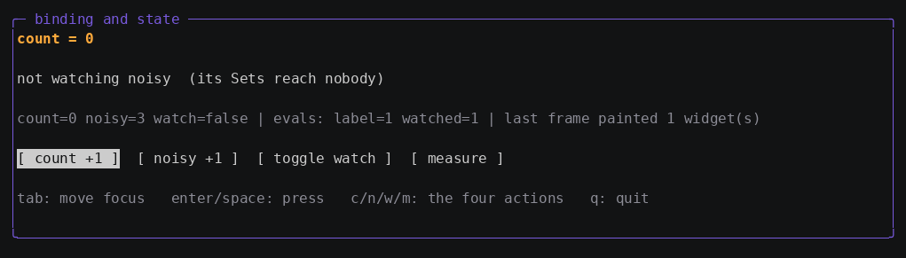
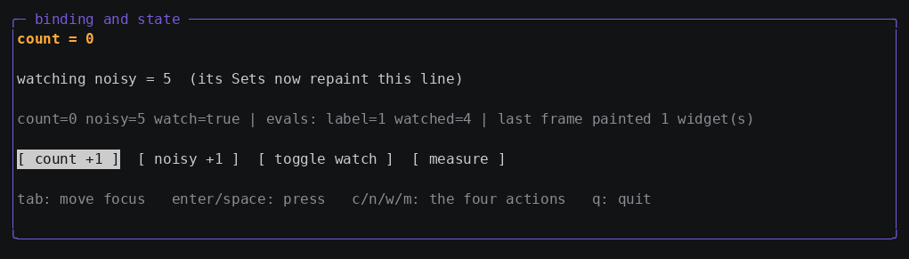

# Tutorial 3: Bind data and drive state

In this tutorial you connect Go state to markup with bindings, derive
values with computed properties, and then make the framework prove its
central rule to you on screen: **whether reading a property subscribes to
it is decided by the call site, not by the property.**

**Time:** about 25 minutes.
**Prerequisites:** [Tutorials 1](01-first-app.md) and [2](02-layout.md).

The finished code is in
[`docs/learn/examples/03-binding-and-state`](examples/03-binding-and-state).

## Step 1: Create source properties

State in gooey is a graph of `*prop.Property[T]` values. A **source**
holds a value you can set:

```go
count := prop.NewSource(0)
noisy := prop.NewSource(0)
watch := prop.NewSource(false)
report := prop.NewSource("press [ measure ] to sample the graph")
```

`Set` marks everything that depends on the property dirty and **computes
nothing**. No callbacks run, no layout happens, nothing repaints. The
work is deferred to the next frame.

> **If you know XAML:** this is the opposite of `DependencyProperty`,
> where `SetValue` eagerly runs change callbacks through the tree. gooey
> is lazy — closer to Slint than to WPF. You never need
> `INotifyPropertyChanged`, and you never need to batch updates by hand:
> twenty `Set`s between two frames collapse into one recomputation.

## Step 2: Derive values with computed properties

A **computed** holds a function instead of a value:

```go
label := prop.NewComputed(func() string {
	return fmt.Sprintf("count = %d", count.Get())
})
```

`Get` re-runs the function only when the computed is dirty. Crucially,
the properties read *during* that run are recorded as its dependencies —
so `label` subscribes to `count` because it read it, not because anyone
declared a relationship.

## Step 3: Bind them in markup

A binding is `{{.Path}}`, where the path is looked up in
`Context.Values`. Add these to `app.gooey`:

```xml
<Text Style="accent">{{.Label}}</Text>
<Text>{{.Watched}}</Text>
<Text Style="dim">{{.Report}}</Text>
```

and expose the properties:

```go
ctx := &markup.Context{
	Values: map[string]any{
		"Label":   label,
		"Watched": watched,
		"Report":  report,
		// ... commands ...
	},
	// ... Styles ...
}
```

Three rules govern what a text binding accepts:

- Each `{{.Path}}` must resolve to a `*prop.Property[string]` (live) or a
  plain `string` (spliced in once). Anything else is a load-time error
  naming the type it found.
- Content can mix literals and bindings: `<Text>lines: {{.Count}} ({{.State}})</Text>`
  becomes a single computed string over its parts.
- The same applies to text-valued attributes — `Border Title`,
  `Button Content`.

Note what this means for an `int` property: markup binds text, so you
convert in a computed rather than in the markup. There are no value
converters and no format strings in the binding DSL. `label` above *is*
the converter.

> **Bindings are handles, not values.** Resolution happens once, when the
> file loads. The built `Text` widget holds the property handle itself,
> so rendering performs zero lookups — and setting the source repaints
> exactly the widgets that read it, with no "refresh" call anywhere in
> your code. This is what the design calls lvalue semantics.

## Step 4: Watch a computed rewire itself

Because re-evaluation re-records dependencies, a computed that takes a
different branch genuinely changes what it subscribes to:

```go
watched := prop.NewComputed(func() string {
	if watch.Get() {
		return fmt.Sprintf("watching noisy = %d  (its Sets now repaint this line)", noisy.Get())
	}
	return "not watching noisy  (its Sets reach nobody)"
})
```

While `watch` is false this function never reads `noisy`, so `noisy` is
not a dependency and setting it reaches nobody at all.

## Step 5: Make the rule visible

`prop.Property[T].Evals()` reports how many times a computed has
evaluated. Add a command that samples the graph:

```go
painted := 0 // widgets repainted by the last frame — a plain Go var

measure := func() {
	report.Set(fmt.Sprintf(
		"count=%d noisy=%d watch=%v | evals: label=%d watched=%d | last frame painted %d widget(s)",
		count.Get(), noisy.Get(), watch.Get(),
		label.Evals(), watched.Evals(), painted))
}
```

and have the loop record the damage count:

```go
_, painted = comp.Frame()
```

Run it, press `n` three times to bump `noisy`, then `m` twice to measure:



Read the line: `noisy=3`, but `watched=1`. Three `Set`s on `noisy`
produced **zero** re-evaluations, because at that moment nothing was
subscribed to it. `label=1` likewise — `count` never changed.

Now press `w` to start watching, bump `noisy` twice more, and measure
again:



`watched=4` — the initial evaluation, one for the `watch` toggle, and one
for each subsequent `noisy` change. The same `noisy.Set` call that was
free a moment ago now costs one re-evaluation and one repaint. Nothing
about `noisy` changed; what changed is who was reading it.

**And `last frame painted 1 widget(s)`** — on a page holding eleven
widgets, changing one bound string repainted exactly one. That is the
damage model, not an optimization pass.

> **Why press `m` twice?** The first press repaints the report line, so
> the number it prints is the damage from the *previous* frame. The
> second press reports the frame that painted only the report line
> itself.

## Step 6: Understand read versus subscribe

Look closely at `measure`. It calls `count.Get()`, `noisy.Get()`, and
`watch.Get()` — the very same calls `watched` makes. Yet running
`measure` subscribes to nothing.

The difference is the call site:

- Inside a computed's evaluation, a `Get` records a dependency edge.
- Outside any evaluation — in a command, an event handler, your `main` —
  a `Get` is a plain read.

One function can mean both things depending on who calls it. `cmd/statedemo`
in this repository leans on exactly that: a single `snapshot()` function
serializes the app either on demand (from a command, subscribing to
nothing) or reactively (from a computed, subscribing to everything it
touched).

The corollary for widget authors: reading a property inside `Render` is
what makes that property a repaint trigger. Tutorial 6 builds on this.

> **The one thing to avoid.** Never `Set` a property that a widget
> painted from as part of producing every frame — the `Set` dirties the
> widget, which schedules another frame, which sets again. That is why
> `painted` above is a plain `int` and not a property: the loop writes it
> every frame, and a plain variable cannot dirty anything.

## What you learned

- Sources hold values; `Set` marks dirty and computes nothing.
- Computeds record their dependencies **by evaluating**, so conditional
  reads subscribe only to the branch actually taken.
- Text bindings need `*prop.Property[string]` or `string`; converting
  from other types is a computed's job, not the markup's.
- Bindings resolve to handles once at load time.
- Whether `Get` subscribes is decided by the call site — that single rule
  explains commands, computeds, and widget painting all at once.
- Changing one bound value repaints one widget.

## Current limitations

- No value converters and no format strings in the binding DSL.
- No two-way binding syntax in markup. Two-way is widget code: the widget
  reads the property in `Render` and calls `Set` when the user acts —
  tutorial 4's checkbox and tutorial 6's stepper both do this.
- Properties are confined to the UI goroutine and unsynchronized. See
  [how-to: work off the UI goroutine](howto/howto-async.md).

## Next steps

- **[Tutorial 4: Handle input with commands and key bindings](04-input-commands.md)**
- Concept: [the property graph](concepts/property-graph.md) ·
  [damage tracking](concepts/damage.md)
- Depth: [architecture.md — the property system](../architecture.md#the-property-system).
