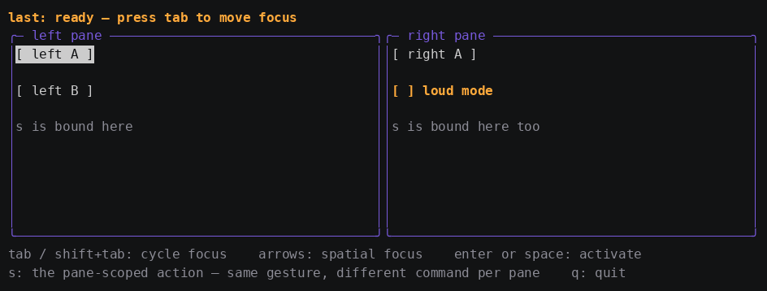

# Tutorial 4: Handle input with commands and key bindings

In this tutorial you wire buttons to commands, declare keyboard gestures
in markup, and learn the rule that makes a key binding *scoped*: the same
`s` key runs a different command depending on which pane has focus.

**Time:** about 25 minutes.
**Prerequisites:** [Tutorial 3](03-binding-and-state.md).

When you finish, you will have this:


The finished code is in
[`docs/learn/examples/04-input-commands`](examples/04-input-commands).

## Step 1: Bind a button to a command

A `gooey.Command` is just `func()`. Put one in your context and bind it:

```xml
<Button Content="left A" Click="{{.LeftA}}"/>
```

```go
Values: map[string]any{
	"LeftA": gooey.Command(func() { last.Set("left A") }),
}
```

A `Button` runs its command on **enter**, **space**, or a **mouse
click**. It renders as `[ label ]` and restyles itself for three states —
focused, hovered, and pressed — each of which is its own property read
during painting, so a state change repaints just that button.

Event attributes accept two forms, and the split matters:

| Form | Resolves against | Use when |
|---|---|---|
| `Click="{{.Save}}"` | `Context.Values` — must hold a `gooey.Action` (`gooey.Command`, or a `*gooey.Cmd` from `gooey.NewCommand`) or a `func()` | The delegate lives in your viewmodel. Works in markup-only controls with **no code-behind at all**. |
| `Click="OnSave"` | `Context.Handlers` — the code-behind registry | You want a named handler registry. An unregistered name is a load-time error. |

An empty event attribute is not an error; the element simply has no
command.

> **If you know XAML:** `Click="{{.Save}}"` is `Command="{Binding Save}"`
> without `ICommand`, `RelayCommand`, or a `CommandParameter`. There is
> no `CanExecute` yet, so there is no automatic disabled state — a
> command is either bound or not.

## Step 2: Declare gestures in markup

`<KeyBinding>` is a non-visual element. It is never measured and never
painted; it attaches to whichever element encloses it.

```xml
<KeyBinding Gesture="q" Command="{{.Quit}}"/>
<KeyBinding Gesture="ctrl+c" Command="{{.Quit}}"/>
```

`Gesture` is zero or more `+`-separated modifiers followed by a key.
Modifier order does not matter and matching is case-insensitive.

| Part | Accepted spellings |
|---|---|
| Modifiers | `ctrl` / `control` / `c`, `alt` / `meta` / `option`, `shift` |
| Named keys | `enter`, `tab`, `esc`, `backspace`, `delete`, `up`, `down`, `left`, `right`, `home`, `end`, `pageup`, `pagedown`, `space` |
| Characters | any single rune: `j`, `q`, `/` |
| The `+` key | spell it out: `ctrl++` |

Two normalizations reflect what terminals actually send: `shift` on a
printable character folds into the rune (`shift+j` matches `J`, and the
shift modifier is dropped), and `ctrl+<letter>` lowercases the letter,
because control bytes decode to the lowercase rune.

## Step 3: Scope a binding to a pane

This is the payoff. Give each pane its own `s` binding by declaring it
**inside** that pane:

```xml
<Grid Grid.Row="1" Cols="1*,1*">
  <Border Grid.Col="0" Title="left pane" Style="panel">
    <VStack Gap="1">
      <Button Content="left A" Click="{{.LeftA}}"/>
      <Button Content="left B" Click="{{.LeftB}}"/>
    </VStack>
    <KeyBinding Gesture="s" Command="{{.LeftScoped}}"/>
  </Border>

  <Border Grid.Col="1" Title="right pane" Style="panel">
    <VStack Gap="1">
      <Button Content="right A" Click="{{.RightA}}"/>
      <Checkbox Checked="{{.Loud}}" Label="loud mode"/>
    </VStack>
    <KeyBinding Gesture="s" Command="{{.RightScoped}}"/>
  </Border>
</Grid>
```

Run it and press `s` — focus starts on the first focus stop, `left A`:


Now press `tab` three times to move focus into the right pane, and press
`s` again:


Same key, different command. Nothing arbitrates between them.

### How dispatch decides

A key event walks a single path: start at the **focused component**, then
each ancestor up to the root. At every level, the KeyBindings attached
there are matched first, then that component's own key handler. The first
handler to return true stops the walk.

Before that walk there is a **tunnelling** pass in the other direction:
every ancestor from the root down to the focused component that
implements `gooey.PreviewKeyHandler` is offered the event, and the first
to take it ends the dispatch entirely. That is the parent-veto phase —
a modal scrim swallowing what is aimed at the layer beneath it — and
nothing uses it unless a component opts in, so it changes nothing about
the pages above.

So a binding fires only while the focused component's path to the root
passes through the element it was declared on. That gives you three
useful tiers for free:

- **Global** — declared on the root element. Every path reaches it.
- **Pane-scoped** — declared on a pane's `Border`, as above.
- **Component-local** — a component's own `HandleKey`, which sees keys only
  while it has focus (tutorial 6).

> **Remember from tutorial 1:** if a page has *no* focus stops, dispatch
> starts at the root, and only root-attached bindings can ever fire.

## Step 4: Move focus

Focus is framework-owned. The `FocusManager` is built from the same tree
walk that builds the Composer, focuses the first focus stop, and moves on
unconsumed keys:

- `tab` / `shift+tab` cycle through focus stops in tree order, wrapping,
  skipping anything inside a Collapsed subtree.
- Unconsumed **arrow keys** move focus spatially — the nearest focus stop
  whose center lies in that direction, preferring targets roughly in line
  with the current one. When nothing lies that way it falls back to tree
  order, so a direction is never a dead end.
- A **mouse press** focuses the nearest focusable component at or above the
  hit. Failing that it descends, which is what makes clicking a pane's
  border or title focus the pane.



The order in which these are tried is what makes arrow-driven components
possible: navigation runs only in the **unconsumed tail**. A component that
handles `left`/`right` itself keeps them; the framework never sees them.

### Focus damage is free

Watch the highlight in the GIF: exactly two components change. `FocusState`
keeps the focused flag in a source property, so a component that reads
`IsFocused()` while painting picks up focus changes as ordinary damage.
Moving focus repaints the component losing it and the component gaining it, and
nothing else. There is no focus-specific redraw path in the framework.

## Step 5: Add a checkbox and feel the graph

`Checkbox` is not a built-in — it is a custom component this example
registers, and [tutorial 6](06-custom-components.md) takes it apart line by
line. What matters here is that it binds a `bool` property two-way:
`Render` reads it, toggling `Set`s it.

```xml
<Checkbox Checked="{{.Loud}}" Label="loud mode"/>
```

Make the status line depend on it:

```go
status := prop.NewComputed(func() string {
	s := "last: " + last.Get()
	if loud.Get() {
		return strings.ToUpper(s)
	}
	return s
})
```

Tab to the checkbox and press space. The status line changes case
immediately, and no command anywhere touched it — the checkbox `Set` a
property, the computed that read it went dirty, and the one component bound
to that computed repainted. This is the same mechanism from tutorial 3,
now driven by input.

## Step 6: Use the mouse

Click a button. Hover over one. Both already work: the App turns on
pointer reporting for you — button events, any-motion tracking so hover
works with no button held, and the SGR extended encoding, the only one
that survives past column 223 and distinguishes press from release.
Teardown disables it unconditionally, so not even a crash leaves your
terminal in tracking mode.

A program that would rather not receive motion reports declines them:

```go
app := gooey.NewApp(content, gooey.WithoutMouse())
```

See [how-to: handle mouse input](howto/howto-mouse.md) for hover,
implicit capture, and click synthesis.

## What you learned

- A command is `func()`; event attributes bind one from the viewmodel
  (`{{.Save}}`) or resolve one by name from a handler registry.
- `<KeyBinding>` attaches to its enclosing element, and dispatch walks
  focused-component-to-root — which is what scopes it.
- Focus is framework-owned: tab cycles in tree order, unconsumed arrows
  navigate spatially, and a press focuses what it hit.
- Components that consume a key stop it from reaching navigation.
- Focus and hover are source properties, so focus movement repaints
  exactly two components.
- Mouse support is one call, and it cleans up after itself.

## Beyond the basics

- **Conditional commands.** `gooey.NewCommand(save).When(dirty)` attaches
  a `CanExecute` condition that is an ordinary bool property. A Button
  bound to it paints dim and refuses activation while the condition is
  false, and a KeyBinding whose command is disabled lets the gesture keep
  bubbling. Markup is unchanged — the binding resolves the richer command
  transparently.
- **Tunnelling.** `PreviewKeyHandler` / `PreviewMouseHandler` see events
  on the way down, root first, and can veto them.
- **Mouse capture.** A press captures automatically for the length of the
  gesture; `FocusManager.CaptureMouse` / `ReleaseCapture` take it
  explicitly for a drag that must outlive one press.
- **Editing.** `TextBox` does mid-string editing: word-wise caret
  movement with ctrl, shift-selection, cut/copy/paste through a
  process-local kill buffer, drag-to-select and double-click-to-select.
  See the [markup reference](../markup-reference.md#textbox) for the full
  key table.

## Still missing

- Triple click, and any selection gesture beyond a word.
- System-clipboard integration (OSC 52); cut and copy stay inside the
  process.

## Next steps

- **[Tutorial 5: Build reusable controls](05-usercontrols.md)**
- How-to: [key bindings and gestures](howto/howto-keybindings.md) ·
  [mouse input](howto/howto-mouse.md)
- Concept: [input routing](concepts/input-routing.md)
