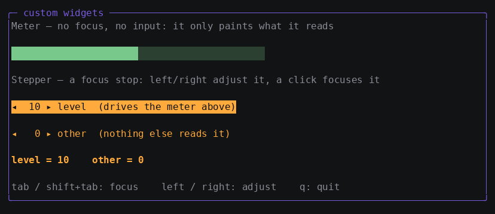
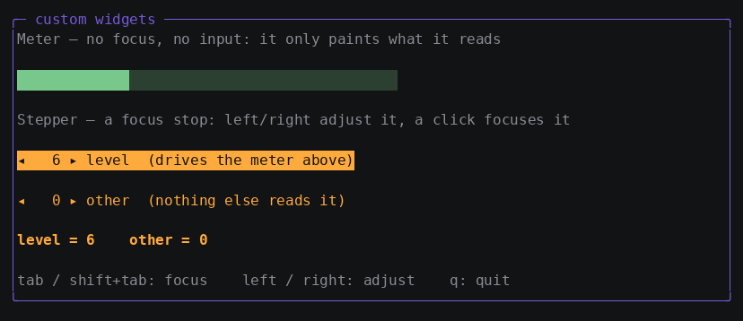

# Tutorial 6: Write a custom widget

In this tutorial you implement two widgets from scratch: a **meter** that
only paints, and a **stepper** that takes focus and handles keys and
clicks. Along the way you see why reading a property inside `Render` is
the only thing that makes it a repaint trigger.

**Time:** about 30 minutes.
**Prerequisites:** [Tutorial 3](03-binding-and-state.md); tutorial 5
helps but is not required.

When you finish, you will have this:



The finished code is in
[`docs/learn/examples/06-custom-widgets`](examples/06-custom-widgets).

## Step 1: Know what a widget owes the framework

`gooey.Widget` has three methods:

```go
type Widget interface {
	Measure(avail Size) Size  // how big do you want to be, within avail?
	Arrange(bounds Rect)      // here are your final bounds
	Render(f *Frame)          // paint YOURSELF into those bounds
}
```

Embedding `gooey.Base` supplies `Arrange` and `Bounds()`, plus the
universal layout attributes (`Width`, `Margin`, `Grid.Row`, …) and the
ability to host `<KeyBinding>` attachments. So in practice a leaf widget
implements `Measure` and `Render` and inherits the rest.

Two rules that are easy to get wrong:

- **`Render` paints this widget only.** The framework walks children —
  a widget with children implements `ChildWidgets() []Widget` and lets
  the framework descend. This is what lets the Composer give every widget
  its own paint node.
- **Never call `Measure`/`Arrange` on a child directly.** Go through
  `gooey.MeasureChild` and `gooey.ArrangeChild`, which apply margin,
  explicit size, visibility, and alignment — the measure/arrange
  sandwich. Bypassing them silently breaks every layout attribute for
  your children.

> **If you know XAML:** `Measure`/`Arrange` are `MeasureOverride` and
> `ArrangeOverride`, and `Render` is `OnRender`. The difference is that
> gooey's `Render` is *not* a full-tree walk — it is a graph node the
> framework evaluates on demand.

## Step 2: Build a widget that only paints

```go
type meter struct {
	gooey.Base
	value *prop.Property[int]
	max   int
}

func (m *meter) Measure(avail gooey.Size) gooey.Size {
	return gooey.Size{W: avail.W, H: min(1, avail.H)}
}

func (m *meter) Render(f *gooey.Frame) {
	b := m.Bounds()
	filled := 0
	if m.max > 0 {
		filled = m.value.Get() * b.W / m.max
	}
	filled = max(0, min(filled, b.W))
	bar := strings.Repeat("█", filled) + strings.Repeat("░", b.W-filled)
	f.Cells.SetString(b.X, b.Y, bar, render.Style{Fg: render.RGB(120, 200, 140)})
}
```

Three things to notice.

**`Measure` returns a want, not a promise.** Clamp to `avail` and let the
parent decide. Returning `avail.W` means "give me everything you have" —
the right answer for a bar.

**Paint into `Bounds()`, never at absolute coordinates.** `Arrange` has
already placed you; `f.Cells.Set`/`SetString` clip at the buffer edge,
but painting outside your own bounds will collide with siblings that the
Composer considers clean.

**`m.value.Get()` is the whole damage declaration.** The Composer runs
`Render` inside this widget's paint node, so every property read during
painting is recorded as a dependency of that node. Any `Set` on `value`
— from this widget, another widget, or a background result — dirties this
meter and only this meter. You never declare `AffectsRender` and never
call `InvalidateVisual`.

The corollary is worth stating plainly: **a property you do not read
while painting cannot repaint you.** If a widget stops reacting to a
value, the first thing to check is whether `Render` actually reads it.

## Step 3: Register it as a markup element

`Context.Widgets` maps an element name to a `Builder`. The builder gets
the raw element and interprets attributes however it likes:

```go
Widgets: map[string]markup.Builder{
	"Meter": func(e markup.Element, c *markup.Context) (gooey.Widget, error) {
		v, err := intAttr(c, e, "Value")
		if err != nil {
			return nil, err
		}
		m, err := strconv.Atoi(e.Attrs["Max"])
		if err != nil {
			return nil, fmt.Errorf("<Meter Max=%q>: %w", e.Attrs["Max"], err)
		}
		return &meter{value: v, max: m}, nil
	},
}
```

with `intAttr` doing the `BindingValue` plus type-assert dance from
tutorial 5:

```go
intAttr := func(c *markup.Context, e markup.Element, name string) (*prop.Property[int], error) {
	v, err := c.BindingValue(e.Attrs[name])
	if err != nil {
		return nil, err
	}
	p, ok := v.(*prop.Property[int])
	if !ok {
		return nil, fmt.Errorf("<%s %s>: got %T, want *prop.Property[int]", e.Name, name, v)
	}
	return p, nil
}
```

Now use it:

```xml
<Meter Value="{{.Level}}" Max="20" Width="44"/>
```

`Width="44"` is not something your builder handles. The framework applies
the universal layout attributes **after** the builder returns, so any
widget embedding `Base` gets them for free.

A registered builder wins over every other resolution path, so you can
also shadow a built-in element name if you ever need to.

## Step 4: Join the focus and input system

Now a widget that participates in input. Embedding `gooey.FocusState`
makes it a focus stop:

```go
type stepper struct {
	gooey.Base
	gooey.FocusState
	value *prop.Property[int]
	label string
}

func (s *stepper) Measure(avail gooey.Size) gooey.Size {
	return gooey.Size{W: min(len([]rune(s.label))+10, avail.W), H: min(1, avail.H)}
}

func (s *stepper) Render(f *gooey.Frame) {
	b := s.Bounds()
	st := render.Style{Fg: render.RGB(255, 170, 60)}
	if s.IsFocused() {
		st.Reverse = true
	}
	text := fmt.Sprintf("◂ %3d ▸ %s", s.value.Get(), s.label)
	f.Cells.SetString(b.X, b.Y, text, st)
}
```

`FocusState` keeps the focused flag in a **source property**. Reading
`IsFocused()` during `Render` therefore makes focus ordinary paint
damage, which is why moving focus repaints exactly two widgets. A widget
that embeds `FocusState` but never reads `IsFocused()` will be focusable
and look identical either way — that is a bug you write yourself, not one
the framework can catch.

Handle keys:

```go
func (s *stepper) HandleKey(ev input.KeyEvent) bool {
	switch ev {
	case input.Named(input.KeyLeft):
		s.value.Set(s.value.Get() - 1)
		return true
	case input.Named(input.KeyRight):
		s.value.Set(s.value.Get() + 1)
		return true
	}
	return false
}
```

`HandleKey` is called while this widget has focus, before the event
bubbles to ancestors. **Returning true consumes the event** — which is
exactly why these arrows never reach the framework's spatial focus
navigation. Return false for anything you do not handle, or you will
swallow the page's key bindings.

Handle the mouse, optionally:

```go
func (s *stepper) HandleMouse(ev input.MouseEvent) bool {
	if ev.Kind == input.MouseClick {
		s.value.Set(s.value.Get() + 1)
		return true
	}
	return false
}
```

`MouseClick` is synthesized by the framework when a press and its release
land on the same widget; focus has already moved here by then. If you
want raw motion (for a drag), implement `HandleMouseMove` instead —
motion is high-frequency and is delivered only to widgets that ask.

Register and use it:

```xml
<Stepper Value="{{.Level}}" Label="level  (drives the meter above)"/>
<Stepper Value="{{.Other}}" Label="other  (nothing else reads it)"/>
```

## Step 5: Watch two widgets share one property

Run it and press the right arrow a few times:



The first stepper and the meter are bound to the **same** `Level`
handle. The stepper `Set`s it; the meter read it while painting, so the
meter repaints. Neither widget knows the other exists, and no code
connects them — the graph does.

Tab to the second stepper and adjust it: the meter does not move, because
nothing that paints the meter reads `Other`.

## Step 6: If your widget has children

A container implements `ChildWidgets()` and lets the framework walk them.
Three rules keep damage tracking correct:

```go
func (p *myPanel) ChildWidgets() []gooey.Widget { return p.Children }

func (p *myPanel) Measure(avail gooey.Size) gooey.Size {
	// go through MeasureChild, and cache what you'll need in Arrange
	s := gooey.MeasureChild(p.Children[0], avail)
	return s
}

func (p *myPanel) Arrange(b gooey.Rect) {
	p.Base.Arrange(b)                                  // record your own bounds
	gooey.ArrangeChild(p.Children[0], gooey.Rect{...}) // then place children
}

func (p *myPanel) Render(f *gooey.Frame) {} // paint only your OWN chrome
```

- Call `p.Base.Arrange(b)` first so your own bounds are recorded, then
  arrange children.
- **Never clear your own bounds in `Render`.** A container's bounds
  enclose its children's cells, and wiping them blanks content whose own
  paint nodes are clean and will not repaint. The framework pre-clears
  leaves only; containers overpaint their chrome in place. `Border` is
  the model: it draws its box and title and nothing else.
- Do not paint children from your `Render`. The framework walks them.

## What you learned

- A widget is `Measure`/`Arrange`/`Render`; `Base` supplies `Arrange`,
  bounds, layout attributes, and attachment hosting.
- Reading a property inside `Render` is what makes it a repaint trigger —
  the entire damage declaration.
- `Measure` states a want clamped to `avail`; paint only inside
  `Bounds()`.
- `FocusState` makes a widget a focus stop, and reading `IsFocused()`
  makes focus free damage.
- `HandleKey` returning true consumes the event and stops navigation;
  `HandleMouse` sees synthesized clicks, `HandleMouseMove` sees motion.
- Route children through `MeasureChild`/`ArrangeChild`, and never
  pre-clear a container's own bounds.

## Current limitations

- Widget properties are plain Go fields you wire yourself; there is no
  declarative property system for third-party widgets yet.
- `gooey.Image` exists but has **no built-in markup element** — its
  fields are plain values because the pixel pipeline predates the
  property model. Register it as a custom widget to use it from markup;
  see [how-to: draw images](howto/howto-images.md).
- No DataTemplates, so list-shaped data means writing a rows widget.

## Next steps

- How-to: [testing your app](howto/howto-testing.md) — verify widgets
  under a pty.
- Concept: [damage tracking](concepts/damage.md)
- Depth: [architecture.md — the Composer](../architecture.md#the-composer).
- The demos in `cmd/` are the larger worked examples;
  [demos.md](../demos.md) catalogs what each one exercises.
