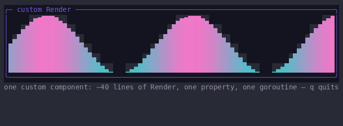

# How to draw anything with a custom Render

gooey has no "you may not paint that" rule. Every component's `Render`
paints whatever it likes inside its own bounds — no framework
permission, no template, no restricted drawing surface. When markup
cannot express what you want, twenty lines of `Render` can, and that
escape hatch is the floor under every built-in component: `Border`,
`Gauge`, and `ColorPicker` stand on exactly the API this page describes.



> **If you know XAML:** `Render` is `OnRender`. The differences are all
> simplifications: there is no `DrawingContext` — you write cells into a
> buffer directly; there is no visual-tree permission or `Freezable`
> machinery; and `Render` is not part of a full-tree walk — it is a
> lazily evaluated graph node, run only when something it read has
> changed. What WPF calls `AffectsRender` metadata, gooey **discovers**
> from the reads your `Render` performs.

[Tutorial 6](../06-custom-components.md) builds a component from scratch
— `Measure`, registration, focus, input. This page is the painting
surface in full: what the `Frame` hands you, what is cleared for you,
and what your reads mean.

## The surface: what a Frame hands you

```go
func (w *wave) Render(f *gooey.Frame)
```

**`f.Cells` is the cell plane** — a `render.Buffer` of styled runes:

```go
f.Cells.Set(x, y, '▲', style)          // one cell
f.Cells.SetString(x, y, "text", style) // a run, left to right
```

Both clip at the buffer edge, so painting off-screen is safe. Painting
outside your own **bounds** is not: `Arrange` already placed you, and
cells beyond `Bounds()` belong to siblings whose paint nodes the
Composer considers clean. Always paint relative to your bounds:

```go
b := w.Bounds() // gooey.Rect{X, Y, W, H}, set during Arrange
f.Cells.SetString(b.X, b.Y, "top-left of ME", st)
```

## A wide glyph occupies two cells

A CJK character or an emoji is **two columns**, and the terminal advances
by two when it draws one. So `SetString` gives it two cells: the glyph in
the first, and `render.Continuation` — a sentinel rune, never drawn — in
the second. That keeps cell index equal to terminal column, which is what
makes `Bounds()` mean anything ([#358](https://github.com/WonderForgeLabs/gooey/issues/358)).

Three consequences for a custom `Render`:

- **Measure in columns, not runes.** `len([]rune(s))` is not a width.
  Use `render.StringWidth(s)`, and `render.ClipCols(s, w)` to fit a
  string into `w` cells — it stops *before* a glyph that would overrun,
  so it can return one column short. That is deliberate; half a glyph is
  not something a terminal can draw.
- **Advance by what you wrote, not by what you were given.** After
  `f.Cells.SetString(x, y, shown, st)`, the next column is
  `x + render.StringWidth(shown)`. If `shown` came from `ClipCols`, the
  original string's length is the wrong number.
- **Restyling a cell is `SetCell`, not `Set`.** To change only a style —
  a selection highlight, an accelerator underline — read the cell, set
  the style, and hand the whole cell back:
  `b.SetCell(x, y, b.At(x, y).WithStyle(st))`. Going through
  `Set(x, y, c.Rune, c.Style)` looks equivalent and is not: `Set` takes a
  *rune*, so a cell holding a grapheme cluster comes back as its first
  rune alone — `"⚠️"` narrows to a one-column `"⚠"` and a decomposed
  `"é"` loses its accent. The row then shifts under the highlight and
  repairs itself when the highlight moves away.

  One caveat when you restyle a **span** this way: `SetCell` refuses a
  cell whose rune is `render.Continuation`, because a continuation is
  written only as the tail of the pair its lead writes. So the second
  column of a wide glyph keeps its old style. Nothing looks wrong — the
  flusher never emits a continuation's style, so the lead's covers both
  columns — but the buffer stops matching the screen, which matters if
  you later decide what to un-highlight by reading styles back. Drive
  that from your own state, not from the plane.
- **Assigning `Buffer.Cells` directly is the one sharp edge.** `Set`,
  `SetString` and `SetCell` all repair a glyph you overpaint half of, so
  ordinary drawing is safe. A loop that writes the slice does not get
  that, and clipping such a copy mid-glyph leaves either an orphan
  continuation (a column nothing can ever repaint) or a lead that shifts
  the rest of the row. If you copy cells, copy pairs — and
  `render.Displaced(b, y)` will tell you whether a row survived,
  including the case of a wide lead left in the final column.

The style is the full per-cell surface:

```go
render.Style{Fg, Bg render.Color; Bold, Dim, Underline, Reverse bool}
```

with `render.RGB(r, g, b)` for colors and the zero value meaning
"terminal default". You always paint in 24-bit color; the flush
quantizes to what the terminal can show.

**`f.Caps` is the terminal you are painting onto.** It is a plain field,
not a property — capabilities cannot change mid-session — and it is how
one component gives a different experience per terminal:

```go
f.Depth()      // render.TrueColor, Color256, or Color16 — shorthand for f.Caps.Color
f.Caps.Best()  // "kitty", "sixel", "iterm2", or "halfblock"
f.Caps.CellW, f.Caps.CellH // pixel size of one cell; zero if unknown
```

The reasoning tier by tier is written out in
[`components/colorpicker.go`](../../../components/colorpicker.go): on
truecolor, paint the smooth gradient; on 256 colors it will band, so say
what the terminal will really show; on 16, a gradient is a lie — draw
the honest simpler thing instead.

**`f.Place` is the pixel plane**, for when cells are not enough:

```go
if f.Graphics != nil && f.CellW > 0 && f.CellH > 0 {
	f.Place(graphics.Placement{Img: img, Col: b.X, Row: b.Y, Cols: 12, Rows: 4})
} else {
	// degrade into cells: halfblocks, box-drawing, whatever is honest
}
```

`f.Graphics` is nil when the terminal has no graphics protocol, and then
the component must draw its cell-plane version instead.

**Test all three, and test `CellH` as well as `CellW`.** An encoder scales
to `cols*CellW × rows*CellH`, so a zero in *either* metric asks it for an
image of zero pixels — over cells your `else` branch never got to paint,
because the placement branch already returned. Nothing errors; the region
is simply blank. The two metrics are independently fatal, so a guard that
checks only the width ships half the bug (issue #251, where core's own
`Image` had this for its entire life). `f.CellW` and `f.Caps.CellW` are
the same value — `SetCaps` writes both — so either spelling works; the
shipped components use the short one. The shipped
exemplars are [`components/buttonchrome.go`](../../../components/buttonchrome.go)
— a pixel pill sliced around a cell-plane label — and
[`components/colorpicker.go`](../../../components/colorpicker.go)'s
per-pixel gradient bars; both paint honest cells beneath their
placements, which is what protocols without placement identity repaint
from. [How to draw images](howto-images.md) covers the protocols
themselves.

## Your reads are your damage set

The Composer runs your `Render` inside a paint node of the property
graph. Every `prop` `Get` you perform while painting is recorded as a
dependency of that node — so the set of properties you read **is** your
repaint trigger list. Nothing is declared:

```go
func (w *wave) Render(f *gooey.Frame) {
	p := w.phase.Get() // subscribe: any Set(phase) now repaints this wave, and only it
	…
}
```

Two corollaries, both load-bearing:

- **A property you do not read while painting cannot repaint you.** If a
  component stops reacting, check that `Render` actually reads the value
  on every path — a read hidden behind an early `return` or the
  short-circuit side of `&&`/`||` silently drops out of the dependency
  set on the frames where it does not run. Hoist the `Get`s to the top.
- **The same `Get` outside `Render` is just a read.** The call site
  decides what a read means (the rule from
  [Tutorial 3](../03-binding-and-state.md)); only reads inside an
  evaluating node subscribe.

This is what makes custom components cheap. Damage counts are a
contract, not an aspiration — the repo's tests assert that focus moves
repaint exactly two components — and your component joins that contract by
reading precisely what it paints from. To see your own numbers, count
repaints under a test the way
[how to test a gooey app](howto-testing.md) shows.

## What is cleared for you

Before a **leaf** repaints, the framework pre-clears its bounds — not to
the terminal default, but to the nearest visible ancestor's declared
`Background`. A wave inside a colored panel does not punch a black hole
when it repaints alone, and any cell your `Render` leaves untouched
shows the panel's fill. That ancestor read happens inside your paint
node, so recoloring the panel repaints you automatically.

Two practical consequences:

- **You need not erase your own trail.** The pre-clear wipes your rect
  every repaint; paint the current state and skip the empty cells.
- **Beware `Style{}` on cells you mean to leave "empty".** Writing a
  space with a zero style paints terminal-default background over the
  panel fill. Leave the cell alone instead.

**Containers are the opposite: never clear your own bounds.** A
container's bounds enclose its children's cells, and wiping them blanks
content whose own paint nodes are clean and will not repaint. A
container paints only its own chrome (`Border` is the model: box, title,
nothing else). If you want a filled surface, declare it — implement
`gooey.HasBackground` (return a `*prop.Property[render.Color]`) and the
framework paints the fill and z-orders the repaint of everything above
it.

## Animate with Startable

A component that changes on its own — a wave, a spinner, a chart tailing
a feed — owns a goroutine. The framework's lifecycle hook is
`gooey.Startable`:

```go
type Startable interface {
	Start(post func(func())) (stop func())
}
```

The Composer discovers Startable elements in the tree when the
composition goes live and calls each `stop` on Close — quit and hot
reload both, so a replaced tree never leaves a ticker running. Two rules
make an implementation correct:

- **Post, never touch.** The goroutine must not `Get` or `Set` —
  properties belong to the UI goroutine. It posts a closure via `post`,
  and the closure runs on the loop where `Set` is safe (and where your
  `Render`'s subscription picks it up).
- **`stop` must close *and join*.** Signal the goroutine, then wait for
  it to exit before returning. A tick that already won its `select` will
  still post after a signal-only stop; joining makes "after stop, no
  posts" true.

**You do not write either of them for a ticker.** `gooey.Every` owns both:

```go
func (w *wave) Start(post func(func())) (stop func()) {
	return gooey.Every(post, 80*time.Millisecond, func() {
		w.phase.Set(w.phase.Get() + 1)
	})
}
```

The func you pass runs on the UI loop, so it may `Get` and `Set` freely;
nothing else in the closure may. A non-positive interval or a nil `fn`
is a Startable **declining to start** — the returned stop is a no-op and
no goroutine exists — rather than a panic out of `time.NewTicker`.

For the shape a ticker cannot serve — an unbounded number of one-shot
delays that must stop together, like a tooltip's show-after-hover or a
toast's dismissal — embed a `gooey.Delays` and forward `Start` to it;
`After(d, fn)` arms one, and the group's stop cancels every delay that
has not fired and joins every one that has.

Both live in [`startable.go`](../../../startable.go), and that file is
where the contract is written down. Reaching for a hand-rolled
`done`/`stopped` pair now says "neither shape fits mine" — which is a
claim worth being sure of, because nothing in the framework checks it.
[`components/timer.go`](../../../components/timer.go) is the framework's
own worked example: `gooey.Every` plus an `Enabled` property read at
fire time, on the loop, so the graph can pause a ticker without tearing
anything down.

## The worked example

[`docs/learn/examples/howto-custom-draw`](../examples/howto-custom-draw)
is the whole pattern in one file — a scrolling sine wave in eighth-block
runes, ~40 lines of component:

```sh
cd docs/learn/examples/howto-custom-draw && go run .
```

It demonstrates every section above at once: `Measure` states a want,
`Render` paints only inside `Bounds()`, one `phase.Get()` is the entire
damage declaration, `f.Depth()` picks a gradient on truecolor and one
honest color elsewhere, untouched cells keep the panel's pre-cleared
fill, and `Start` is one `gooey.Every` call that posts ticks to the loop
and joins on stop.

At full size, the same pattern is all over `cmd/`:
`cmd/markuplog`'s **LogPane** (a scrollback pane as a registered markup
element), [`components/gauge.go`](../../../components/gauge.go) (a
labelled bar in one `SetString`), and
[`components/sparkline.go`](../../../components/sparkline.go) (a series
plotted in block rows). All three are short and readable.

## See also

- [Tutorial 6: Write a custom component](../06-custom-components.md) —
  `Measure`, markup registration, focus, and input for the same
  component.
- Concept: [damage tracking](../concepts/damage.md) — why paint is a
  graph node.
- [How to draw images](howto-images.md) — the pixel protocols behind
  `f.Place`.
- Depth: [architecture.md — the Composer](../../architecture.md#the-composer).
